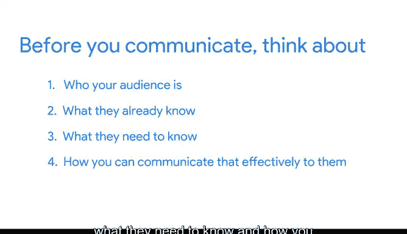

# 027：清晰沟通是关键 🗣️

在本节课中，我们将学习与利益相关者和团队成员进行清晰沟通的重要性。我们将探讨如何通过思考受众来规划沟通，从而建立更好的工作关系，并确保项目顺利进行。

---

上一节我们讨论了理解利益相关者和团队的重要性。本节中，我们来看看如何通过清晰沟通来平衡各方需求，并保持对项目目标的明确关注。

建立良好工作关系的一个关键部分是与你共事的人进行有效沟通。如何做到这一点？两个词：**清晰沟通**。

首先，思考一下你在日常生活中可能遇到的沟通挑战。例如，你是否曾讲一个非常有趣的笑话，却发现朋友已经知道笑点，或者他们根本不觉得好笑？这种情况经常发生，尤其是在你不了解听众的情况下。工作场所也可能出现类似问题。

有效沟通的一个秘诀是：在准备演示、发送电子邮件，甚至向同事讲那个有趣的笑话之前，先思考你的受众是谁。你需要考虑：
*   他们**已经知道**什么。
*   他们**需要知道**什么。
*   你如何能**有效地**将这些信息传达给他们。

当你首先考虑受众时，他们会感受到你的用心，并感激你花时间考虑了他们的需求。

---

为了更具体地说明，让我们通过一个例子来应用这些原则。

假设你正在处理一个分析年度销售数据的大项目，并且发现所有在线销售数据都缺失了。这个问题可能影响整个团队，并显著延迟项目进度。

通过思考以下四个问题，你可以规划出与团队沟通此问题的最佳方式：

**1. 你的受众是谁？**
在这个案例中，你需要联系参与该项目的其他数据分析师、你的项目经理，以及最终的利益相关者——销售副总裁。

**2. 他们已知什么？**
*   其他数据分析师知道你在使用哪些数据集的所有细节。
*   项目经理知道你正在遵循的时间线。
*   销售副总裁知道项目的高层目标。

**3. 他们需要知道什么才能推进工作？**
*   其他数据分析师需要知道你迄今为止尝试过的细节以及你想到的任何潜在解决方案。
*   项目经理需要知道可能受影响的团队以及这对项目的影响，特别是如果此问题改变了时间线。
*   销售副总裁需要知道存在一个可能延迟或影响项目的潜在问题。

**4. 如何有效地与他们沟通？**
现在你已决定了谁需要知道什么，可以选择最佳沟通方式。与其发送一封冗长且令人担忧的电子邮件（可能导致大量来回沟通），你决定快速与项目经理和其他分析师安排一次会议。

在会议中，你告知团队在线销售数据缺失的情况，并提供更多背景信息。大家一起讨论这如何影响项目的其他部分。作为一个团队，你们制定一个计划，并在需要时更新时间线。

在这种情况下，销售副总裁无需被邀请参加会议，但如果时间线有变，他会感谢收到一封邮件更新（你的项目经理可能会亲自发送）。

---

当你进行周到沟通并首先考虑受众时，你将与团队成员和利益相关者建立更好的关系和信任。这很重要，因为这些关系是项目成功的关键，也是你个人成功的关键。

因此，当你准备发送电子邮件、组织会议或准备演示时，请思考：
*   你的**受众**是谁？
*   他们**已经知道**什么？
*   他们**需要知道**什么？
*   你如何能**有效地**将这些信息传达给他们？

---

本节课中，我们一起学习了清晰沟通的核心原则：**以受众为中心**。通过预先思考“谁需要知道什么以及如何告知”，你可以避免误解，建立信任，并更有效地推动项目前进。

下一节，我们将进一步探讨职场沟通，并学习一些确保信息清晰传达的实用技巧。