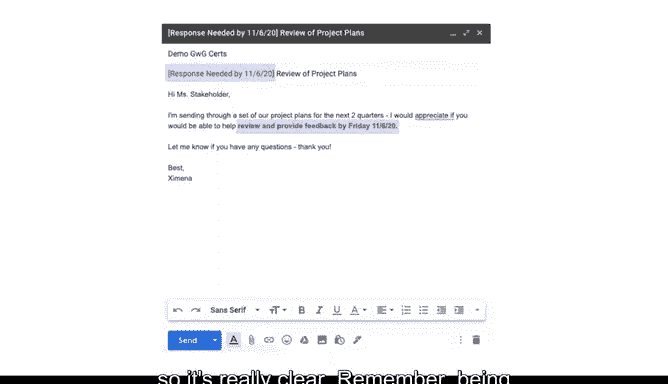

# 028：有效沟通技巧 📧

在本节课中，我们将学习如何在职场中进行有效沟通。无论你身处哪个团队或组织，良好的沟通技巧都是成功协作的关键。我们将探讨如何适应不同的沟通期望，并掌握一些通用的沟通策略。

## 适应团队沟通风格

当你开始一份新工作或新项目时，可能会发现自己与团队的沟通方式不太同步。这完全正常。只要你愿意边做边学，并在不确定时主动提问，很快就能适应。

例如，如果你的团队使用你不熟悉的缩写，不要害怕询问其含义。当我刚加入谷歌时，我不知道“LGTM”是什么意思，后来我了解到它代表“Looks Good To Me”。现在，当我需要快速给出反馈时，我经常使用它。这是我学到的众多缩写之一，我还会不断遇到新的缩写，而我从不害怕提问。

## 理解职场礼仪

每个工作环境都有其特定的礼仪。你的团队成员可能重视眼神交流和有力的握手，或者在与国际客户合作时，鞠躬可能更为礼貌。通过观察同事的沟通方式，你也能发现一些特定的礼仪规则。

## 掌握电子邮件沟通技巧

除了面对面交流，你还需要处理电子邮件沟通。每天有近3000亿封电子邮件被发送和接收，这个数字还在不断增长。幸运的是，你可以从这些数字沟通中学到有用的技巧。

以下是帮助你撰写专业电子邮件的一些建议。

### 良好的写作习惯

良好的写作习惯能让你的电子邮件显得专业且易于理解。电子邮件天生比短信更正式，但这并不意味着你需要写出一部伟大的小说。只需花时间写出拼写和标点正确的完整句子，就能清楚地表明你在写作时经过了深思熟虑。

电子邮件经常被转发给其他人阅读，因此要写得足够清晰，让任何人都能理解。我喜欢在发送重要邮件前大声朗读出来，这样我就能听出它们是否通顺，并发现任何拼写错误。

请记住，你邮件的语气会随着时间的推移而改变。如果你的团队氛围比较随意，那很好。一旦你更了解他们，你也可以开始变得更随意。但保持专业始终是一个好的起点。

一个很好的经验法则是：如果你写的内容被刊登在报纸头版，你会为此感到自豪吗？如果不会，那就修改到你满意为止。

### 保持简洁明了

你也不希望你的邮件太长。想想你的团队成员需要知道什么，然后直奔主题，而不是用大段文字让他们不知所措。

你需要确保你的邮件清晰简洁，这样它们才不会在众多信息中被淹没。

让我们快速看一下两封邮件，以便你理解我的意思。

以下是第一封邮件：
> 嘿，关于我们昨天讨论的那个项目，我想跟进一下。我一直在思考我们谈到的数据问题，我觉得可能有一些方法可以改进。另外，我注意到报告中有一个小错误，可能需要修正。还有，下周的会议时间确定了吗？我们需要提前准备材料。对了，你看到市场部发来的新需求了吗？我觉得那个也挺重要的。

这封邮件里“我们”这个词用得太多，以至于很难看出重要信息在哪里。而且第一段没有快速总结重要的要点。它也比较随意，问候语只是“嘿”，也没有结束语。另外，我已经发现了一些拼写错误。

现在，让我们看看第二封邮件：
> 主题：关于XX项目数据问题的跟进及下周会议安排
>
> 尊敬的[同事姓名]，
>
> 希望您一切顺利。
>
> 此邮件旨在跟进我们昨日讨论的XX项目。主要事项如下：
> 1.  **数据问题**：我已初步构思了三种改进方案，详见附件草案。
> 2.  **报告修正**：发现第5页图表有一处数据标注错误，已在本邮件修正版本中高亮标出。
> 3.  **下周会议**：暂定下周三下午2点，请确认您的时间是否方便。会议材料将在周一前准备好并分享。
> 4.  **市场部新需求**：已查阅，其优先级评估已加入项目计划表。
>
> 请您在**本周五下班前**就上述事项，特别是会议时间给予反馈。
>
> 祝好，
> [你的名字]

这封邮件看起来不那么令人不知所措，对吧？只用几句话告诉了我需要知道的内容。它组织清晰，并且有礼貌的问候和结束语。这是一个简短扼要、礼貌且书写良好的电子邮件的好例子，包含了我们到目前为止讨论的所有要点。

## 何时选择会议沟通

但是，如果你需要说的内容对于一封邮件来说太长了怎么办？那么，你可能需要安排一次会议来代替。

## 及时回复的重要性

及时回复同样重要。你不希望回复邮件的时间太长，以至于你的同事开始担心你是否安好。我总是尽量在24到48小时内回复邮件，即使只是告诉他们我将在何时给出他们正在寻找的确切答案。这样，我可以设定预期，让他们知道我正在处理。

反之亦然。如果你需要从某位团队成员那里得到关于某件具体事情的回复，请明确你需要什么以及何时需要，以便他们能够回复你。我甚至会在邮件主题行中包含日期，并在正文中加粗日期，使其非常清晰。

请记住，明确表达你的需求是成为一个良好沟通者的重要组成部分。

## 总结

本节课中，我们一起学习了提升职业沟通技能的一些有效方法，例如主动提问、培养良好的写作习惯以及一些电子邮件沟通的技巧。这些方法将帮助你在任何项目中与团队成员进行清晰有效的沟通。虽然可能需要一些时间，但只要你愿意学习，你就能找到适合你和你的团队的沟通风格，无论是在线下还是线上，你都能轻松适应未来工作中遇到的不同沟通期望。