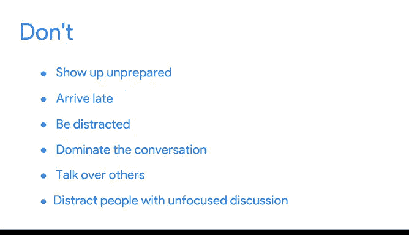

# 033：会议最佳实践 📅

在本节课中，我们将学习如何高效组织和参与会议。会议是与团队成员及利益相关者沟通的核心环节。掌握会议的最佳实践，能帮助团队建立信任、协调目标，并更有效地解决问题。

---

## 会议的核心价值

上一节我们探讨了沟通的基础，本节中我们来看看会议的具体作用。会议不仅是项目进展的汇报平台，更是团队协作的基石。

无论是线上还是线下，会议都能：
*   **建立信任与团队精神**：提供超越邮件往来的直接交流机会。
*   **提供宏观视角**：了解合作者，能更好地认识自身工作在整体项目中的位置。
*   **协调团队目标**：定期会议使目标对齐更容易，从而更顺利地实现目标。
*   **促进问题解决**：当所有人信息同步时，团队能更好地互相协助，共克难题。

因此，无论是主持会议还是参与会议，遵循最佳实践都至关重要。

---

## 会议成功的关键行动 ✅

以下是确保会议成功的几个简单而有效的行动准则，适用于所有会议场景：
*   **充分准备**
*   **准时出席**
*   **保持专注并积极提问**

让我们详细拆解如何实践前两项准则。

### 如何做到“充分准备”

“充分准备”包含多个方面：

1.  **携带所需物品**：如果你习惯做笔记，请准备好笔记本、笔或工作设备。
2.  **提前阅读议程**：会前阅读会议议程，并准备好汇报自己的工作进展。
3.  **主持者的额外准备**：如果你是会议主持者，需准备好讲稿和演示材料，明确要讨论的内容，并准备好回答问题。

作为会议主持者，我还遵循以下原则：

*   **会议应有明确决策目标**：每次会议都应聚焦于做出一个明确的决策。
*   **关键决策者必须出席**：确保能做出该决策的关键人员在场。
*   **及时安排决策会议**：如果需要通过会议来决策，应立即安排，不要等到下周的例会，以免延误进度。
*   **控制会议规模**：尽可能将参会人数控制在**10人**以内。人数过多会阻碍协作性讨论。

### 如何做到“尊重他人时间”

尊重团队成员时间的最佳方式是守时。

*   **准时参会**：作为参与者，务必准时。
*   **主持者提前准备**：作为主持者，应提前到场并完成设置，以便在人员到齐后立即开始。
*   **线上会议同理**：对于线上会议，确保技术设备提前调试好，并注意时间，避免意外错过会议。
*   **保持专注**：在会议期间保持专注和投入，是尊重他人时间的另一重要体现。避免因分心而错过关键信息。

---

## 保持专注与积极沟通

“保持专注”也意味着在需要时积极提问。

*   **及时澄清**：当你需要澄清某个观点，或认为项目计划可能存在问题时，应主动提问。
*   **会后跟进**：如果会上没来得及提问，不要犹豫，在会后跟进小组，获取答案。

对于会议主持者，确保沟通顺畅尤为重要：

*   **提前发布议程**：会前制定并发送议程，让团队成员能带着准备来，带着清晰的收获离开。
*   **鼓励全员参与**：努力与所有参会者互动，以免错过任何团队成员的见解。
*   **开放提问渠道**：明确告知大家，会后也欢迎提问。
*   **做好会议记录**：即使是主持者，做笔记也是个好习惯。这有助于记住所有被提出的问题。会后，你可以根据信息需求范围，选择跟进个别成员回答问题，或向整个团队发送更新。

---

## 会议中应避免的行为 ❌

现在，让我们看看会议中应避免的事项。有些禁忌显而易见：

*   **避免准备不足、迟到或心不在焉**地参加会议。
*   **避免垄断对话、打断他人**或用漫无目的的讨论干扰大家。

请确保给予其他团队成员发言的机会，并在你开始讲话前，让他们完整表达自己的想法。

所有参会者都应有机会贡献意见。创造让大家发言的机会，提出问题，征询专家意见，征求他们的反馈。你不想错过他们宝贵的见解。

此外，尽量让所有人在不发言时将手机或电脑调至静音。

---

## 总结与展望

本节课中，我们一起学习了会议的最佳实践，例如**充分准备、准时出席、保持专注、积极提问**。我们还探讨了如何高效利用会议来**做出明确决策**、促进**协作性讨论**，以及如何在会后跟进以解决遗留问题。

同时，我们也明确了会议中应避免的行为：**准备不足、迟到、分心、打断他人以及忽视他人的意见**。

牢记这些技巧，你将能顺利组织并参与富有成效、积极向上的团队会议。当然，团队中有时难免会出现冲突。我们很快将讨论如何解决冲突。

---