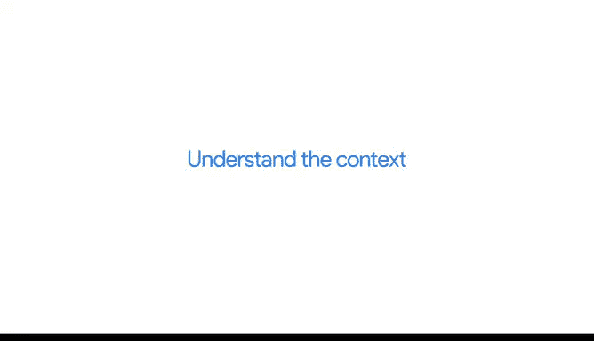

# 035：从冲突到协作 🤝

在本节课中，我们将探讨工作中冲突的产生原因以及如何通过有效的方法将冲突转化为协作机会，从而推动项目顺利进行。

## 概述

工作中出现冲突是正常现象。尽管之前学习的知识（例如管理期望和有效沟通）有助于避免冲突，但冲突有时仍会发生。本节将讨论冲突产生的原因以及解决冲突的最佳实践方法。

## 冲突产生的原因

冲突可能由多种原因引发。

以下是几种常见情况：

*   利益相关者可能误解了项目的预期成果。
*   你与团队成员的工作风格可能存在显著差异。
*   重要截止日期临近时，人们的压力可能增大。

期望不匹配和沟通不畅是冲突最常见的原因。

例如，可能因未明确数据清洗的负责人而导致项目延误；或者，队友发送了一封包含你所有分析见解的邮件，却未提及这是你的工作。

## 以客观态度面对冲突

尽管人们容易将冲突个人化，但保持客观并专注于团队目标至关重要。

事实上，紧张时刻也可能是重新评估项目甚至改进工作的机会。当问题出现时，你可以通过几种方法将局面转向更具生产力和协作性的方向。

## 将问题重构为机会

将局面从“问题重重”转向“富有成效”的最佳方法之一是重构问题。

不要纠结于“哪里出了错”或“该责怪谁”，而是改变你提出的初始问题。尝试询问：“**我如何能帮助你达成目标？**”

这为你和团队成员创造了共同寻找解决方案的机会，而不是因问题而感到沮丧。

## 沟通是解决冲突的关键

如果你发现自己身处冲突之中，请尝试沟通。

开启对话，或询问诸如“**我是否还应考虑其他重要事项？**”之类的问题。这能让你的团队成员或利益相关者有机会充分阐述他们的关切。

如果你发现自己情绪激动，请给自己一些时间冷静下来，以便能以更清晰的头脑进行对话。

例如，如果在紧张时刻需要写邮件，可以先将其保存为草稿，次日再重新审阅，确保自己保持冷静理智后再发送。

## 理解请求的背景

如果你不理解团队成员或利益相关者要求你做什么，请尝试理解他们请求的背景。

询问他们的最终目标是什么、他们试图用数据讲述什么故事，或者整体背景是什么。

## 总结与核心实践

通过将潜在的冲突时刻转化为协作和前进的机会，你可以化解紧张局势，让项目重回正轨。

因此，与其说“**我不可能在这个时间框架内完成**”，不如尝试重构表述：“**我很乐意做这件事，但这需要[具体时间]。让我们退一步，以便我能更好地理解你希望用数据做什么，然后我们可以共同寻找最佳前进路径。**”

---

## 本节总结

在本节中，我们一起学习了工作中冲突的常见起因，并掌握了通过**重构问题**、**积极沟通**和**理解背景**将冲突转化为协作机会的关键方法。这些技巧有助于维护团队和谐，确保项目顺利推进。

正如本课程所强调的，沟通技巧与数据分析技术能力同等重要，是数据分析师专业工具包中的关键组成部分。通过不断实践，你的沟通与协作能力将日益精进。