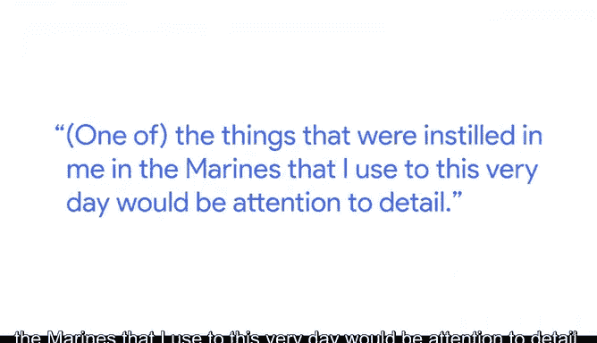

# 036：谷歌数据分析师课程第二课《以数据驱动的决策提出问题》🎯

## 课程概述

在本节课中，我们将跟随谷歌首席数据分析师内森，了解他从美国海军陆战队到数据分析领域的职业转型故事。我们将学习他如何将军事训练中的核心技能成功应用于数据分析工作，并探索他为此转型所做的具体准备。

---

## 个人背景介绍

我是内森，目前在谷歌的信任与安全部门担任首席数据分析师。

我在大学期间加入了美国海军陆战队预备役。我加入的预备役单位是一个野战炮兵部队。

在经历了充满挑战的海军陆战队新兵训练营后，我进入了野战炮兵火力指挥控制学校。

对于可能不了解的听众，火力指挥控制被认为是野战炮兵的大脑。我们使用各种计算机进行炮兵计算。

但为了防止计算机出现故障，我们也接受了使用计算尺作为备用方案的操作训练。

一年后，我获得了被征召为卡车司机的机会，而不是继续我的野战炮兵本职工作。

我被部署到伊拉克，为一个步兵连队驾驶卡车。

从伊拉克回来后，我完成了学士学位，然后在德克萨斯州奥斯汀市担任应用工程师。

最终，我意识到需要转变职业方向，更多地专注于商业领域。

正是在深入学习商业知识的过程中，我真正爱上了数据分析。

实际上，从我对数据分析产生浓厚兴趣，到获得一份能全职从事并深入接触数据的职位，我花了几年的时间。

---

## 转型准备与实践

为了打好基础并获得相应资格，我做了一些准备工作。

以下是我为转型所做的关键努力：

*   我参加了一个关于R语言的Coursera课程。
*   我参与了一些数据科学黑客松。在这些活动中，你需要在某个大学度过整个周末。组织方通常在周五晚上发布数据集，到周日下午，你必须提出一些建议。这是两种非常好的方式，能让我真正做好准备、获得良好经验，并展现出对数据分析的强烈兴趣。

我的第一份全职数据分析工作是在一家大型银行。

我简直如鱼得水，终于可以真正地使用SQL进行实战。同时，我也大量使用了Tableau。

我有机会参加Tableau大会，那真的很酷。

后来，我很幸运地获得了进入谷歌的机会，担任我目前在信任与安全部门的职位。

这项工作最令人兴奋和满足的一点是，它与军队有相似之处，都有一个保护人民的总体使命。这让我感到超级兴奋。

---

## 军事技能在数据分析中的应用

在海军陆战队中培养的、至今我仍在使用的品质包括注重细节。

这在军队中至关重要，尤其是在野战炮兵领域。

其次是沟通的重要性。你掌握了自己的细节后，需要确保能非常清晰地将这些信息传达给与你共事的其他人。

第三点是协作。在军队中，团队合作成就梦想。你确实要依赖团队。这在我离开海军陆战队后的职业生涯和工作中也绝对是如此。

---

## 课程总结

本节课中，我们一起学习了内森从军人到数据分析师的不寻常职业路径。我们了解到，军事训练中培养的**注重细节**、**有效沟通**和**团队协作**能力，是数据分析工作中同样宝贵的技能。同时，通过**系统学习（如Coursera课程）** 和**实践参与（如黑客松）** 来主动构建知识体系与项目经验，是成功实现职业转型的关键步骤。他的故事表明，多元化的背景和软技能能够为数据分析职业带来独特的优势。