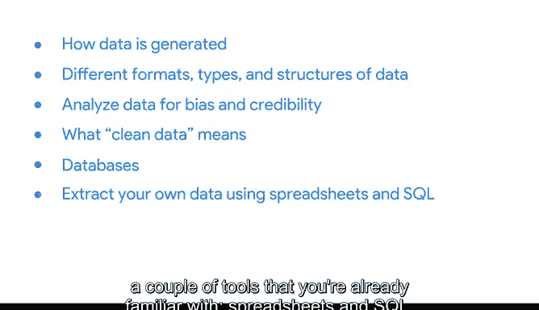

# 001：谷歌数据分析师课程第三课《为数据探索做准备》📊

在本节课中，我们将学习如何为数据分析项目准备数据。我们将了解数据的类型、结构，以及如何提取、使用、组织和保护数据。掌握这些技能能帮助你为手头的问题选择合适的数据，并确保分析过程顺利有效。

---

## 我的故事：数据如何驱动变革 👩💼

上一节我们介绍了课程目标，本节中我们来看看一个真实的数据应用案例。

我是 Hallie，谷歌的分析团队负责人。我帮助医疗保健公司制定数字营销方案，以增强其业务和品牌实力。我的团队基于最新的行业洞察和数据发现商业与媒体机会。

在医疗保健领域工作五年，我深感荣幸。我享受使用数据在这个重要行业中推动变革。数据可以成为一个极具影响力的故事主角，我热爱通过分析，以引人入胜且信息丰富的方式讲述这个故事。

以下是一个工作中的真实案例：
我们分析了随时间变化的医疗保险注册数据，并将其与人们在谷歌上搜索医疗保险计划的行为联系起来。随着65岁及以上人群对其健康决策越来越知情，我利用数据来了解医疗保险注册量是否增加，以及谷歌搜索在其中扮演了什么角色。如果需求增加，我需要确认数据是否相关和有效，同时关注访问与公平性问题，并保护搜索者的隐私。

这个故事的圆满结局是：我的数据和发现对医疗专业人士及其患者非常有用。外界存在大量有用数据，而你正在积累寻找并以最佳方式使用正确数据所需的技能。本课程将继续磨砺这些技能。

---

## 数据分析流程回顾 🔄

在深入了解数据准备之前，我们先快速回顾一下你已经熟悉的数据分析流程步骤。

数据分析流程包括以下阶段：
*   **提问**
*   **准备**
*   **处理**
*   **分析**
*   **分享**
*   **行动**

目前，你已学习了如何提出正确问题、定义问题，并以符合利益相关者需求的方式呈现分析。换句话说，你学会了用数据讲故事。现在，我们将更深入地学习讲述最佳故事所需的数据。

---

## 本课程核心内容 🎯

上一节我们回顾了整体流程，本节中我们将聚焦于“准备”阶段的具体学习目标。

在本课程中，你将学习如何为分析准备数据。具体内容包括：

1.  **识别数据的生成与收集方式**：了解数据从何而来。
2.  **探索不同的数据格式、类型和结构**：认识数据的多样性。
3.  **选择并使用有助于解决业务问题的数据**：确保数据与分析目标匹配。
4.  **评估数据的偏见与可信度**：并非所有数据都适用于每种需求，学会批判性审视数据。
5.  **理解“干净数据”的含义**：认识高质量数据的特点。
6.  **深入了解数据库**：学习数据库是什么以及分析师如何使用它们。
7.  **使用工具提取数据**：你将使用熟悉的工具（电子表格和SQL）从数据库中提取自己的数据。

以下是本课程将涵盖的关键技能领域：

*   **数据组织基础**：数据在组织得当的情况下才能发挥最佳效用。
*   **数据保护流程**：组织数据的同时，你也需要保护它。我将展示如何做到这两点，并将其应用于你自己的分析中。

---

## 耐心与实践是关键 ⏳

学习任何有价值的事物都需要时间和练习，数据准备也不例外。关键在于保持耐心。我会全程陪伴你每一步。

我已经迫不及待地想帮助你，在你继续探索数据分析世界的过程中，书写属于你自己的个人故事了。

让我们一起开始吧！

---

## 总结 📝

本节课中，我们一起学习了数据准备在数据分析中的重要性。我们通过一个案例看到了数据如何解决现实问题，回顾了数据分析流程，并明确了本课程将帮助你掌握的核心技能：从识别和选择数据，到评估其质量，再到从数据库提取、组织并保护数据。记住，耐心练习是掌握这些技能的关键。