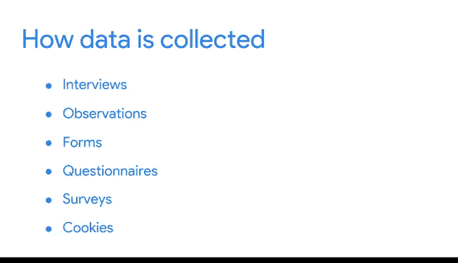

# 003：谷歌数据分析师第三课《为数据探索做准备》 📊

在本节课中，我们将要学习现实世界中数据是如何被生成和收集的。理解数据的来源和收集方式，是进行有效数据分析的重要基础。

---

## 🌍 现实世界中的数据生成

数据正在全球范围内不断生成。我们谈论的是每天每分钟海量的数据。数百万条短信和数亿封电子邮件被发送。除此之外，还有数百万次在线搜索和视频观看，并且这些数字还在持续增长。数据量如此庞大，因此让我们深入了解它是如何产生和使用的。

在本视频中，我们将讨论数据生成的方式以及各行业如何自行收集数据。

---

## 📝 数据的来源与形式

每一条信息都是数据，所有这些数据通常是我们世界活动的产物。如今，我们在社交媒体和移动设备上花费大量时间。每天都有数以百万计的人为庞大的数据总量添砖加瓦。

可以这样理解：每一张在线数字照片都是一条数据，而每张照片本身包含更多数据，从像素数量到每个像素中包含的颜色。

但这并不是数据产生的唯一方式。我们也可以通过收集信息来生成数据。这种数据生成和收集方式需要考虑更多因素。它需要在伦理的考量下进行，以维护人们的权利和隐私。我们稍后会详细学习这一点。

现在，让我们看一个现实世界的例子。

---

## 🏛️ 实例：美国人口普查局

美国人口普查局使用表格来收集有关国家人口的数据。这些数据被用于多种目的，例如为学校、医院和消防部门提供资金。该局还收集有关美国企业等信息。在此过程中，他们生成了自己的数据。

其优点是，其他人随后可以将这些数据用于自己的需求，包括分析。年度商业调查用于了解企业的需求，以及如何为它们提供资源以帮助其成功。

---

## 🏥 行业中的数据生成实践

我本人在为医疗保健行业做分析时也会生成数据。我们进行大量调查，以了解患者对与其医疗保健相关的某些事情的感受。例如，一项调查询问了患者对远程医疗与面对面医生就诊的感受。我们收集的数据帮助我们合作的公司改善其患者接受的护理。

调查数据只是一个例子，各种数据一直在生成，并且收集方式也多种多样。

---

## 🔍 多样化的数据收集方法

即使是像面试这样简单的事情也能帮助某人收集数据。想象一下你正在参加一场工作面试，为了给招聘经理留下深刻印象，你会想要分享关于自己的信息。招聘经理收集这些数据并进行分析，以帮助他们决定是否聘用你。

但这是双向的。你也可以收集关于公司的数据，以帮助你判断这家公司是否适合你。或者，你可以利用收集到的数据来构思向面试官提出的深思熟虑的问题。

科学家们也在工作中通过大量观察来生成数据。例如，他们可能通过研究动物行为或在显微镜下观察细菌来收集数据。

之前我们讨论了美国人口普查局用于收集数据的表格、问卷和调查，这些都是常用且有效的收集和生成数据的方式。

---

## 🍪 注意：间接数据生成

有一点需要注意，在线生成的数据并不总是直接发生的。你是否曾想过，为什么有些在线广告似乎能做出非常准确的推荐，或者有些网站如何记住你的偏好？这是通过使用 **Cookie** 实现的。

**Cookie** 是存储在计算机上的小文件，包含有关用户的信息。Cookie 可以根据你的在线浏览习惯，在不直接识别你个人身份的情况下，帮助广告商了解你的个人兴趣和习惯。

---

## 💡 对数据分析师的意义

作为一名现实世界中的分析师，你将触手可及各种数据，而且数量庞大。了解数据是如何生成的，有助于为数据添加上下文；而了解如何收集数据，则可以使数据分析过程更加高效。

接下来，你将学习如何决定为分析收集哪些数据，敬请期待。

---

## 📚 本节总结

本节课中，我们一起学习了现实世界中数据的多种生成方式，包括直接活动产生、主动收集（如调查、表格）以及间接追踪（如Cookie）。我们还通过人口普查、医疗调查和招聘面试等实例，了解了数据在不同场景下的应用。理解数据的来源是进行准确、有效分析的第一步。