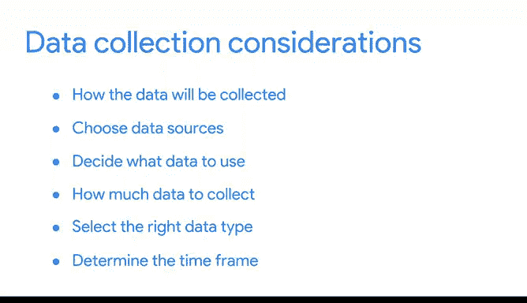

# 004：谷歌数据分析师第三课《为数据探索做准备》📊

## 课程概述

在本节课中，我们将学习如何为数据分析项目确定需要收集的数据。面对近乎无限的数据，做出正确的选择至关重要。我们将探讨在收集数据时需要考虑的关键因素，包括数据来源、数据量、数据类型以及时间范围。

---

## 确定数据来源

上一节我们介绍了数据分析项目的起点。本节中，我们来看看如何确定数据的来源。首先，你需要了解数据将如何被收集。

在分析城市高峰时段交通拥堵原因的例子中，你可能会通过观察交通模式来统计特定时间城市街道上的汽车数量。你注意到车辆在一条特定街道上发生了拥堵。

以下是常见的数据来源类型：

*   **第一方数据**：由个人或组织使用自有资源直接收集的数据。在交通案例中，你的观察记录就是第一方数据。这通常是首选方法，因为你确切知道数据的来源。
*   **第二方数据**：由某个组织直接从其受众收集，然后出售的数据。如果你无法自行收集数据，可以向在本市进行过交通模式研究的组织购买。这些数据虽非你原创，但由于来自有交通分析经验的源头，通常仍然可靠。
*   **第三方数据**：从外部来源获取的、非其直接收集的数据。这些数据在到达你手中之前可能已经过多次转手，因此可靠性可能较低。但这并不意味着它没有用处，你只需确保检查其准确性、偏见和可信度。

实际上，无论使用何种数据，都需要检查其准确性和可信度。我们将在后续课程中更详细地了解这个过程。现在，请记住你选择的数据应适用于你的需求，并且必须经过使用授权。

---

## 选择相关数据

作为数据分析师，你的职责是决定使用哪些数据。这意味着选择能帮助你找到答案和解决问题的数据，而不被其他无关数据分散注意力。

在我们的交通案例中，财务数据可能帮助不大，但关于高流量时段的现有数据则会非常有帮助。

---

## 确定数据量：总体与样本

接下来，我们讨论需要收集多少数据。在数据分析中，**总体**指的是某个特定数据集中所有可能的数据值。

**公式：** `总体 = {数据集中的所有可能值}`

如果你要分析一个城市的汽车交通数据，那么总体就是该区域的所有汽车。然而，从整个总体中收集数据可能非常具有挑战性。

这时，**样本**就非常有用了。样本是总体中具有代表性的一部分。

**公式：** `样本 ⊆ 总体`

你可以收集城市中一个地点的数据样本并分析那里的交通情况，或者从总体中的所有现有数据中随机抽取一个样本。如何选择样本将取决于你的具体项目。

---

## 选择合适的数据类型

在收集数据时，你还需要确保为数据选择了正确的类型。对于交通数据，一个合适的数据类型可能是以日期格式存储的交通记录日期。

**代码示例（伪代码）：** `交通记录日期：YYYY-MM-DD`

这些日期可以帮助你判断未来一周中哪些日子可能出现高流量交通。我们很快会更详细地探讨这个话题。

---

## 确定数据收集的时间范围

最后，你需要确定数据收集的时间范围。在我们的例子中，如果你需要立即得到答案，就不得不使用**历史数据**，即已经存在的数据。

但假设你需要跟踪很长一段时间内的交通模式，这可能会影响你在数据收集过程中做出的其他决策。

---

## 课程总结

本节课中，我们一起学习了数据分析师在收集数据时需要考虑的不同因素。你现在更了解如何确定数据来源、选择相关数据、决定数据量（总体与样本）、选择合适的数据类型以及设定时间范围。正因为掌握了这些，当你开始自行收集数据时，你将能够找到正确的数据。关于数据收集，还有更多内容需要学习，请继续关注接下来的课程。