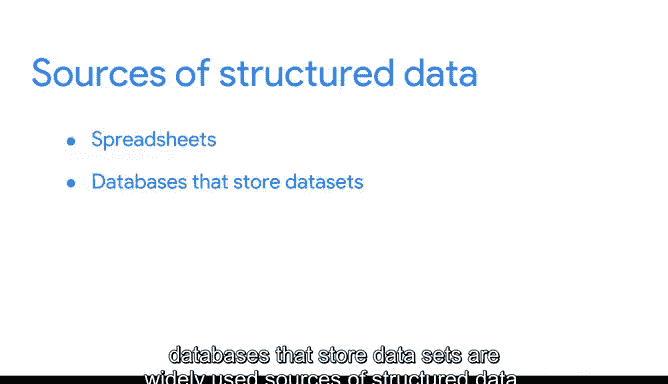

# 006：06_01_03_继续探索结构化数据.zh_en - GPT中英字幕课程资源 - BV19X4y1n7Xd

## 课程概述 📋

在本节课中，我们将继续深入学习结构化数据。我们将探讨结构化数据如何与数据模型协同工作，以及它在数据库和数据可视化中的应用。通过本课，你将更清晰地理解为什么结构化数据是数据分析师最常处理的数据类型。

## 结构化数据的重要性

上一节我们比较了结构化数据和非结构化数据。现在，我们来更深入地看看结构化数据。

当前生成的大多数数据实际上是非结构化的。音频文件、视频文件、电子邮件、照片和社交媒体都是非结构化数据的例子。这些数据以其原始的非结构化格式分析起来可能更困难。

但好消息是，你大部分时间都将处理结构化数据。例如，当你需要分析关于非结构化数据（如电子邮件、照片和社交媒体网站）的数据时，这些数据很可能在你接触到之前就已经被结构化以便分析了。

因此，我想进一步探讨一下结构化数据，作为一个快速回顾。

## 结构化数据与数据模型

结构化数据是以行和列等格式组织的数据。但这其中肯定有更多内容。

结构化数据在**数据模型**中运行良好。数据模型是一种用于组织数据元素及其相互关系的模型。

什么是数据元素？它们是信息片段，例如人名、账号和地址。数据模型有助于保持数据的一致性，并提供数据组织方式的蓝图。这使得分析师和其他利益相关者更容易理解他们的数据并将其用于业务目的。

## 结构化数据的应用

除了在数据模型中运行良好之外，结构化数据对数据库也很有用。这使得分析师可以在需要时轻松地输入、查询和分析数据。

这也有助于使数据可视化变得相当容易，因为结构化数据可以直接应用于图表、图形、热图、仪表板和大多数其他数据可视化表示。

## 总结与预告

好了，现在我们知道了存储数据集的电子表格和数据库是广泛使用的结构化数据源。

在探索了一些其他数据结构之后，你将使用电子表格来查看更多的数据类型。冒险仍在继续。

## 本节课总结 🎯

本节课我们一起学习了结构化数据的核心概念。我们了解到，尽管非结构化数据大量存在，但分析师主要处理的是经过组织的结构化数据。我们探讨了结构化数据如何通过数据模型保持一致性，以及它如何简化数据库操作和数据可视化过程。理解这些基础，将为你后续使用电子表格等工具探索具体数据类型打下坚实的基础。