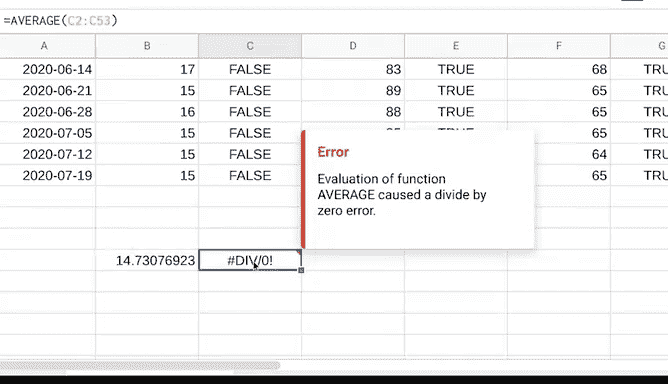

# 007：谷歌数据分析师第三课《为数据探索做准备》data-preparation 📊

## 07_01_01 了解你正在处理的数据类型

在本节课中，我们将要学习如何描述和分析数据的一个关键方面：**数据类型**。理解数据类型是进行有效数据探索和准备的基础，它能帮助你避免常见的错误，并确保后续分析的准确性。

到目前为止，你已经学习了很多关于数据的知识，从生成的数据到收集的数据，再到数据格式。尽可能多地了解你将用于分析的数据是有益的。在本视频中，我们将讨论另一种描述数据的方式：数据类型。

**数据类型**是一种特定的数据属性，它说明了数据是哪种类型的值。换句话说，数据类型告诉你正在处理的是哪种数据。

数据类型可能因你使用的查询语言而异。例如，SQL允许不同的数据类型，具体取决于你使用的数据库。不过现在，让我们专注于在电子表格中使用的数据类型。我们将使用一个已填充数据的电子表格，称之为“全球通过谷歌搜索对甜点的兴趣”。

### 电子表格中的数据类型

在电子表格中，数据类型可以是以下三种之一：**数字**、**文本（或字符串）** 或**布尔值**。你可能会发现有些电子表格程序对它们的分类略有不同或包含其他类型，但这些值类型几乎涵盖了你在电子表格中能找到的任何数据。接下来我们将逐一查看。

#### 数字数据类型

观察B、D和F列，我们找到了数字数据类型。每个数字代表特定一周内对“纸杯蛋糕”、“冰淇淋”和“糖果”这些词的搜索兴趣度。数字越接近100，表示该搜索词在该周越受欢迎。100代表峰值受欢迎度。

请记住，在这种情况下，100是一个相对值，而不是实际的搜索次数。它代表特定时间段内的最大搜索量。可以将其视为满分100分中的百分比。所有其他搜索也按100分制进行估值。在其他数据集中你可能也会注意到这一点。100分是满分。如果需要，你可以将数字更改为百分比或其他格式，如货币。

这些都是数字数据类型的例子。

#### 文本（字符串）数据类型

在H列，数据显示了基于搜索数据每周最受欢迎的甜点。例如，在单元格H4中（对应2019年7月28日开始的那一周），最受欢迎的甜点是“冰淇淋”。这是一个**文本数据类型**或**字符串数据类型**的例子，它是一个包含文本信息的字符和标点符号序列。

在这个例子中，该信息是甜点的名称。文本也可以包含数字，如电话号码或街道地址中的数字，但这些数字不会用于计算。因此，在这种情况下，它们被视为文本，而不是数字。

#### 布尔数据类型

在C、E和G列，看起来我们有一些文本。但这里的文本不是文本或字符串数据类型，而是**布尔数据类型**。布尔数据类型是一种只有两个可能值的数据类型：**True**（真）或**False**（假）。

C、E和G列显示的是布尔数据，用于表示每周的搜索兴趣度是否至少为50（满分100）。其工作原理如下：我们创建了一个公式来计算B、D和F列中的搜索兴趣数据是否大于或等于50。在单元格B4中，搜索兴趣度是14。因此，在单元格C4中，我们找到了单词“false”，因为本周数据的搜索兴趣度小于50。

因此，对于C、E和G列中的每个单元格，仅有的两个可能值是“true”或“false”。我们可以更改公式，让其他单词出现在这些单元格中，但它仍然是布尔数据。你很快将有机会阅读更多关于布尔数据类型的内容。

### 常见问题：混淆数据类型与单元格值

现在，让我们讨论人们在电子表格中遇到的一个常见问题：**混淆数据类型与单元格值**。

例如，在单元格B57中，我们可以创建一个公式来计算其他单元格中的数据。这将为我们提供数据集中所有周内对纸杯蛋糕的平均搜索兴趣度，大约为15。该公式有效，因为我们使用了数字数据类型进行计算。

但是，如果我们尝试使用文本或字符串数据类型（如C列中的数据）进行计算，就会得到一个错误。错误值通常发生在输入单元格值时出错。因此，你越了解数据类型以及使用哪种类型，遇到的错误就越少。

以上就是关于数据类型的介绍。我们还没有结束。接下来，我们将更深入地探讨数据类型、字段和值之间的关系。稍后见。

---

### 总结

本节课中，我们一起学习了**数据类型**这一核心概念。我们了解到，在电子表格分析中，数据主要分为三种类型：用于计算的**数字**、用于描述信息的**文本（字符串）**，以及用于表示逻辑状态的**布尔值（True/False）**。正确识别和使用数据类型是避免计算错误、确保数据准确性的关键。在下一节中，我们将基于此知识，进一步探索数据类型如何与数据字段和具体数值相互作用。