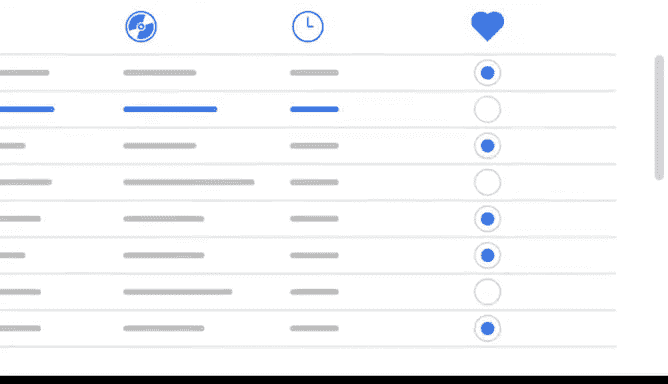

# 008：谷歌数据分析师第三课《为数据探索做准备》 📊

## 08_01_03 数据表组件

在本节课中，我们将要学习数据表的基本组件。理解数据表的结构是进行数据分析的基础。我们将探讨数据表如何组织信息，以及如何识别其中的关键元素。

---

给你出一个谜语。音乐播放列表、日历日程和电子邮件收件箱有什么共同点。

给你一个提示。答案不是每周的即兴演奏会。答案是它们都以表格形式排列。

你可以查看你的电子邮件收件箱或一个最喜欢的播放列表。或者看看你的日历日程。

每一个里面都有表格。数据表或表格数据具有非常简单的结构。

它以行和列的形式排列。你可以将行称为记录，将列称为字段。

它们基本上指的是同一件事。但记录和字段可以用于任何类型的数据表。

而行和列通常专用于电子表格。

在讨论结构化数据库时，数据分析领域的人通常使用记录和字段这两个术语。

有时，字段也可以指单个数据片段，例如单元格中的值。无论如何。

在本课程和你的工作中，你都会听到这两个术语的版本。

让我们回到播放列表的例子。我们将使用刚刚介绍的新术语。

所以每首歌都是一个**记录**。每条记录都与其他记录具有相同顺序的相同**字段**。

换句话说，播放列表对每首歌都有相同的信息。每个歌曲特征。

例如歌曲标题或艺术家，都是一个**字段**。每个单独的字段具有相同的数据类型。

但不同的字段可以有不同的类型。让我以歌曲列表为例说明我的意思。

歌曲标题是文本或字符串类型，而歌曲长度可以是数字类型（如果你用它进行计算）。

或者它可以是日期和时间类型。收藏夹列是布尔类型。

因为它有两个可能的值：已收藏或未收藏。

我们可以以同样的方式看待电子表格。电子表格中的记录可能涉及各种事物。

例如客户、产品、发票或任何其他东西。每条记录都有几个字段。

这些字段揭示了关于客户、产品或发票的更多信息。

每个单元格中的值都包含一个特定的数据片段。

例如客户的地址或发票的金额。作为一名数据分析师。

你将接触到大量数据，而数据表中的记录、字段和值将帮助你进行导航分析。

理解你正在处理的表格结构是其中的一部分。希望。

当你在努力分析那些表格时。

你可以用另一种数据表来获得一点乐趣。那就是你最喜欢的播放列表。😊。