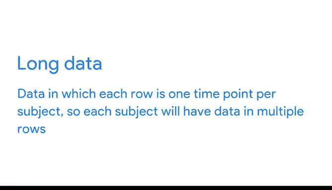

# 009：谷歌数据分析师第三课《为数据探索做准备》 📊

## 第九节：认识宽数据与长数据

在本节课中，我们将要学习数据在表格中的两种常见组织形式：宽数据与长数据。理解这两种格式对于有效存储、组织和分析数据至关重要。

---

### 宽数据格式介绍

上一节我们讨论了数据的基本结构，本节中我们来看看数据如何以“宽”的格式呈现。

宽数据格式中，每个数据主体（例如一个国家、一个人）占据一行，而该主体的各个属性值则分布在多个列中。这种格式便于我们横向比较不同属性。

以下是一个宽数据在电子表格中的示例：

在这个关于拉丁美洲和加勒比地区国家人口的数据集中，每一行提供了**一个国家的所有人口信息**。每一列则显示了**不同年份的人口数据**。

宽数据格式的优势在于，它能让你轻松识别并快速比较不同的列。例如，数据按国家字母顺序排列，你可以通过查看各列的值，直接比较安提瓜和巴布达、阿鲁巴及巴哈马每年的入口。

此外，宽数据格式也便于查找和比较一个国家在不同时期的人口。例如，通过对数据进行排序，我们可以发现巴西在2010年拥有所有国家中最高的入口，而英属维尔京群岛在2013年的人口最低。

---

### 长数据格式介绍

了解了宽数据后，现在让我们探索一下数据的“长”格式。

在长数据格式中，数据不再按年份组织成多个列。所有的年份现在都集中在**一个列**中，而每个国家（如阿根廷）会出现在**多行**里，每一行对应一年的数据。这是长数据通常的样子。

长数据是指**每个主体在每个时间点的数据占据一行**。因此，每个主体的数据会分布在多行中。

我们的电子表格被格式化为显示每年的入口数据。这里我们首先看到的是安提瓜和巴布达。

当我们想要观察每个主体在每个时间点的多个变量时，长数据是一种极佳的存储和组织数据格式。

---

### 两种格式的比较与选择

以下是宽数据与长数据核心特点的对比：

*   **宽数据**：结构为 `每个主体一行，每个属性一列`。
*   **长数据**：结构为 `每个主体-时间点组合一行，变量集中在一列`。

使用长数据格式，我们可以用更少的列来存储和分析所有这些数据。此外，如果我们想添加一个新变量（如人口平均年龄），我们只需要增加一列。

如果我们使用宽数据格式，则需要为每一年都增加一列，总共需要增加10列。长数据格式使一切保持紧凑。

如果你想知道应该使用哪种格式，简单的答案是：**视情况而定**。

有时你需要将宽数据转换为长数据格式，有时则相反。在你的工作中，你很可能会同时处理这两种格式，并且在本课程后续内容中，你肯定会再次遇到它们。

---

### 总结与展望

本节课中我们一起学习了数据的两种基本组织形式：宽数据与长数据。我们了解到，数据作为事实的集合，可以呈现出多种不同的格式和结构。

认识数据呈现的各种方式，将在整个数据分析过程中对你大有裨益。你接触各种形式的数据越多，就能越快开始识别在何时使用何种数据。

接下来，你将运用大脑中储存的所有这些知识来完成一项评估。之后，你将学习如何识别和避免数据中的偏见，以及如何秉持可信度、正直和道德。数据冒险之旅继续前进，很高兴你一同前行。😊