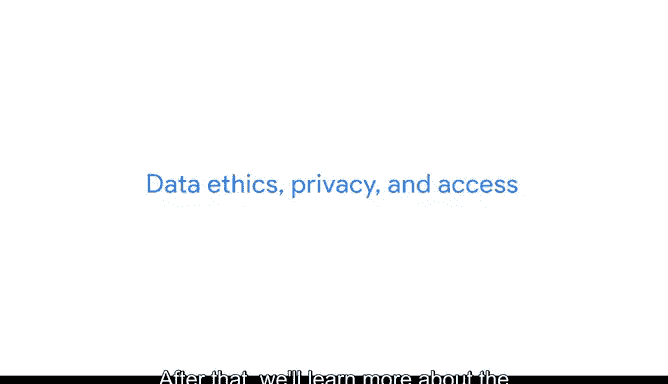

# 010：谷歌数据分析师第三课《为数据探索做准备》 🧭

## 概述

在本节课中，我们将学习数据分析中至关重要的几个概念：**偏差**、**可信度**、**隐私**与**伦理**。理解这些概念能帮助我们确保分析过程的公正性、结果的可靠性，并负责任地处理数据。

---

欢迎回来。在之前的课程中，我们讨论了如何准备数据，以帮助你讲述有意义的故事。现在，让我们看看接下来要做什么。

就像所有精彩的故事一样，你的数据故事也将充满角色、问题、挑战、冲突，并最终希望有一个解决方案。关键在于避免冲突、克服挑战并回答问题。这正是本课程的核心内容。

以下是我们的学习路径。

首先，你将学习如何分析数据的**偏差**与**可信度**。这非常重要，因为即使是最可靠的数据也可能存在偏差或被误解。

上一节我们介绍了课程的整体目标，本节中我们来看看具体的第一步：评估数据质量。

以下是分析数据时需要关注的两个核心方面：
*   **偏差**：指数据中存在的系统性错误或倾向，可能导致分析结果不准确或不公平。
*   **可信度**：指数据的可靠程度和真实性。

接着，我们将学习区分优质数据源和劣质数据源的重要性。是的，就像我们小时候被教导要分清好坏一样。但在数据分析中，我们将探索优质数据源，并学习如何避开它们的对立面——劣质数据。

在了解了如何辨别数据好坏之后，我们将更深入地探讨**数据伦理**、**隐私**和**访问权限**的世界。随着可用数据越来越多，以及我们为使用这些数据而创建的算法变得越来越复杂和精密，新的问题不断涌现。

我们需要提出一些问题。

例如：
*   谁拥有所有这些数据？
*   我们对数据的隐私有多少控制权？
*   我们可以随心所欲地使用和重复使用数据吗？

作为一名数据分析师，理解数据伦理和隐私非常重要，因为在你的工作中，你需要在数据的正确使用和应用方面做出许多判断。

我很高兴能引导你了解其中涉及的一些问题、答案、风险和回报。让我们在下一个视频中，开启这个数据故事的第一章。

---

## 总结

本节课中，我们一起学习了数据分析准备阶段的关键概念。我们明确了本课程将引导我们分析数据的**偏差**与**可信度**，区分优质与劣质数据源，并深入探讨**数据伦理**、**隐私**和访问权限等核心议题。这些知识是进行负责任且有效数据分析的基础。