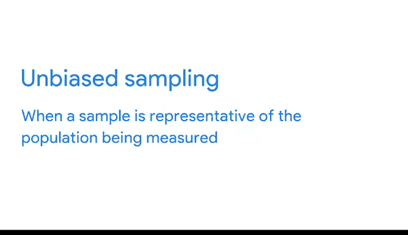

# 012：有偏数据与无偏数据


在本节课中，我们将要学习数据科学中的一个核心概念：数据偏差。我们将探讨什么是有偏数据与无偏数据，理解偏差如何产生，并学习如何识别和避免它们，以确保我们的分析结果是可靠和公正的。

---

## 理解数据偏差

上一节我们介绍了数据准备的重要性，本节中我们来看看数据质量的一个关键威胁：偏差。

到目前为止，我们已经了解到，我们作为人类所持有的偏见最终可能导致产生有偏数据。当我们基于自身的先入之见甚至潜意识观念产生偏好时，我们就存在偏见。当数据存在偏差时，它会系统性地使结果向某个特定方向倾斜，从而使结果变得不可靠。

我们之前以抽样偏差为例进行了说明。抽样偏差是指样本不能代表整体总体的情况。你可以通过确保样本是随机选择的来避免这种情况，这样总体中的所有部分都有平等的机会被纳入样本。

**公式表示：**
`无偏样本 ≈ 随机抽样 (总体中每个个体被选中的概率相等)`

如果在数据收集过程中不使用随机抽样，你最终会偏向于某一个结果。

---

## 一个简单的例子

为了更好地理解偏差，让我们来看一个具体的场景。

假设一个班级里有50名学生，你想知道班里的大多数人是喜欢温暖天气还是寒冷天气。你决定调查你遇到的前10名学生，并根据他们的回答，你断定整个班级都喜欢温暖天气。但是，这里存在一些偏差。

你遇到的前10个人都是女性。因此，你的调查中只包含了女性。你的调查不能公平地代表整个班级，因为它没有包含性别谱系中的其他身份。如果你使用了一个更随机的、包含所有性别的样本，你就会得到一个无偏样本。

无偏抽样会产生一个能代表被测量总体的样本。

---

## 使用可视化识别偏差

上一节我们通过例子了解了抽样偏差，本节中我们来看看一个发现数据偏差的强大工具：数据可视化。

另一个发现你正在处理的数据是否为无偏数据的好方法，是通过可视化将结果生动地呈现出来。在我们刚刚讨论的班级例子中，你可以用一个条形图来可视化整个班级的学生人数及其性别身份。

然后，你可以将其与另一个显示你所调查学生的类似条形图进行比较。这将帮助你轻松识别样本中存在的任何不一致之处。

**代码示例（概念性描述）：**
```python
# 假设我们有以下数据
import matplotlib.pyplot as plt

# 总体数据：班级所有学生的性别分布
total_genders = [‘Male‘， ‘Female‘， ‘Non-binary‘]
total_counts = [25， 20， 5]



# 样本数据：调查中学生的性别分布
sample_genders = [‘Female‘]
sample_counts = [10]

# 绘制对比条形图
fig， (ax1， ax2) = plt.subplots(1， 2)
ax1.bar(total_genders， total_counts)
ax1.set_title(‘总体性别分布‘)
ax2.bar(sample_genders， sample_counts)
ax2.set_title(‘样本性别分布‘)
plt.show()
```

---

## 其他类型的偏差

现在我们已经从抽样的角度了解了偏差是什么样子，接下来让我们探讨一些其他类型的偏差以及如何识别它们。

以下是数据分析中常见的几种偏差类型：

*   **选择性偏差**：由于样本选择方式不当而导致数据不能代表总体。
*   **无应答偏差**：当部分被选中的个体没有提供数据，且这些个体与应答者存在系统性差异时发生。
*   **幸存者偏差**：只关注“幸存”下来的个体或数据，而忽略了那些因为失败或退出而未被观察到的个体。
*   **确认偏差**：倾向于寻找、解释或记忆能够证实自己原有信念或假设的信息。

---

## 总结


本节课中，我们一起学习了数据偏差的核心概念。我们了解到，**有偏数据**会系统性地扭曲分析结果，而**无偏数据**则能更真实地反映总体情况。我们通过一个班级调查的例子，具体看到了抽样偏差是如何产生的，以及**随机抽样**对于获取无偏样本的重要性。此外，我们还介绍了使用**数据可视化**作为识别样本与总体之间差异的有效工具。最后，我们简要列举了数据分析中可能遇到的其他几种偏差类型。理解并避免这些偏差，是确保数据分析工作公正、可靠的关键一步。