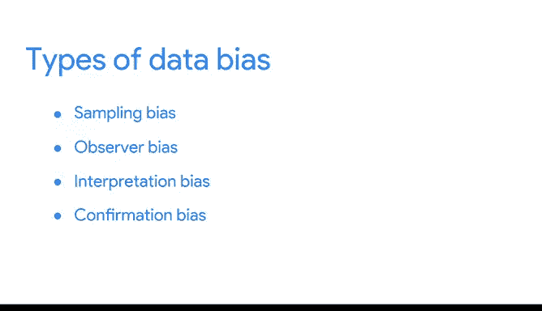

# 013：理解数据中的偏差

在本节课中，我们将要学习数据分析中一个至关重要的概念：数据偏差。我们将探讨除了抽样偏差之外的几种常见偏差类型，了解它们如何影响数据收集与解读，并学习如何避免它们。

上一节我们介绍了抽样偏差，本节中我们来看看其他三种同样重要的偏差类型。

## 观察者偏差 👁️

观察者偏差，有时也称为实验者偏差或研究偏差，其核心是**不同的人倾向于以不同的方式观察同一事物**。

科学家在显微镜下观察细菌以收集数据时，不同的科学家观察同一台显微镜可能会看到不同的东西。这就是观察者偏差。

另一个例子是手动血压测量。由于血压计非常敏感，不同的医护人员可能会得到差异很大的读数。他们通常会四舍五入到最接近的整数来补偿误差范围。但如果医生总是向上或向下取整，就可能错过患者真实的健康状况，任何涉及这些患者的研究也将缺乏精确和准确的数据。

## 解释偏差 🤔

解释偏差是指**倾向于总是以积极或消极的方式解释模糊情况**。

例如，假设你正在与同事共进午餐，这时收到老板的语音留言，让你给她回电话。你生气地放下电话，确信她很生气，你因为某些事要“坐冷板凳”了。但当你把留言放给朋友听时，他完全没有听出生气，反而认为她的语气冷静而直接。

解释偏差会导致两个人看到或听到完全相同的事情，却因为不同的背景和经历，做出多种不同的解释。将这种带有个人色彩的解释加入数据分析，就可能得到有偏差的结果。

## 确认偏差 ✅

最后一种偏差让我想起一句话：**人们只愿意看到他们想看到的东西**。这基本上概括了确认偏差。

确认偏差是指**倾向于寻找或解释信息，以证实自己已有的信念**。一个人可能非常渴望证实自己的直觉，以至于只注意到支持它的信息，而忽略所有其他信号。

这在日常生活中经常发生。我们可能只从某个网站获取新闻，因为作者与我们信念相同；或者我们与某些人交往，因为我们知道他们持有相似的观点。毕竟，相反的观点可能会迫使我们质疑自己的世界观，进而可能导致我们改变整个信念体系。

## 总结与回顾 📝

本节课中我们一起学习了四种主要的数据偏差类型：
*   **抽样偏差**：样本不能代表整体。
*   **观察者偏差**：不同观察者对同一事物的观察结果不同。
*   **解释偏差**：对模糊信息进行带有个人倾向的解释。
*   **确认偏差**：只寻找或接受能证实自己已有信念的信息。

这四种偏差各有特点，但有一个共同点：**它们都会影响我们收集和理解数据的方式**。遗憾的是，这只是数据分析师生涯中可能遇到的偏差类型的一小部分。但好消息是，一旦你了解了几种，你就会时刻警惕任何形式的偏差。

同样重要的是要记住，无论使用何种数据，**所有数据都需要检查其准确性和可信度**。我们将在后续探索“坏数据”时更详细地讨论这一点。