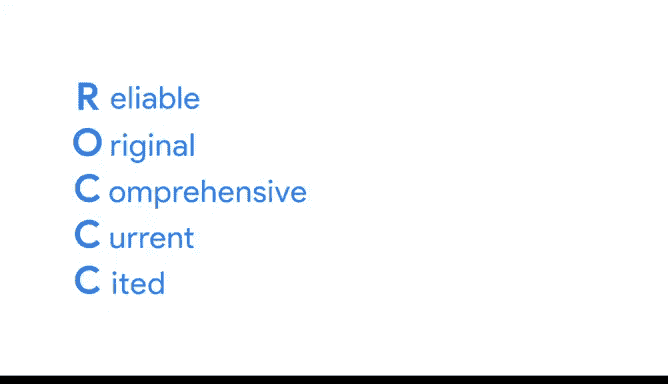

# 014：谷歌数据分析师第三课《为数据探索做准备》📊

在本节课中，我们将学习如何识别优质数据源。高质量的数据是做出可靠决策的基础，掌握评估数据源的方法至关重要。

## 概述

数据质量直接影响分析结果的可靠性。本节将介绍一套实用的评估框架，帮助您判断数据源是否值得信赖。

## 识别优质数据源：ROCK框架

上一节我们介绍了数据准备的重要性，本节中我们来看看如何系统地评估数据源。我们可以使用一个名为“ROCK”的框架，它代表**可靠、原始、全面、最新、可引用**。

以下是ROCK框架的五个核心维度：

*   **R - 可靠**
    优质数据源提供的数据是**可靠**的。这意味着数据准确、完整、无偏见，并且经过验证，适合使用。公式可以表示为：`可靠数据 = 准确性 + 完整性 + 无偏性`。

*   **O - 原始**
    您可能通过第二手或第三手渠道发现数据。为确保数据质量，务必与**原始**来源进行验证。

*   **C - 全面**
    最佳数据源应包含回答问题或找到解决方案所需的所有关键信息。这就像评估一家公司不能只看一条好评，而需要研究其各个方面。

*   **C - 最新**
    数据的实用性会随时间推移而降低。例如，您不会用一份十年前的客户名单来邀请现有客户参加活动。优质数据源提供的数据是**最新**且与当前任务相关的。

*   **C - 可引用**
    可引用性使您提供的信息更具可信度。选择数据源时，请思考三个问题：
    1.  谁创建了该数据集？
    2.  它是否来自可信的组织？
    3.  数据最后一次更新是什么时候？

如果数据来自可靠组织的原始数据，并且具备全面、最新和可引用的特性，那么它就是优质的。

## 优质数据源的常见类型

现在您已经知道如何识别优质数据，以下是几种公认的优质数据来源：

*   经过审核的公共数据集
*   学术论文
*   金融数据
*   政府机构数据

## 总结

本节课中我们一起学习了评估数据源质量的ROCK框架。该框架强调数据应具备**可靠、原始、全面、最新、可引用**的特性。掌握这些原则能帮助您在数据分析的起步阶段就奠定坚实的基础，从而更有信心地做出决策。接下来，我们将了解低质量数据的常见问题以及如何避免它们。