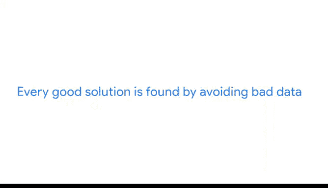

# 015：谷歌数据分析师第三课《为数据探索做准备》data-preparation 📊

## 课程概述

在本节课中，我们将要学习如何识别和避免劣质数据。我们将回顾优质数据的标准，并详细探讨劣质数据的各种特征及其潜在危害。

## 回顾优质数据标准

上一节我们介绍了如何识别和寻找优质数据源，这个过程可以总结为 **ROC** 标准。我们发现，如果数据是可靠的、原始的、全面的、最新的和被引用的，那么它就是优质的。

## 认识劣质数据

本节中，我们来看看劣质数据源。它们不符合 **ROC** 标准，即不可靠、非原始、不全面、不最新、未被引用。更糟糕的是，它们可能完全错误或充满人为失误。

我们将再次从 **R** 开始分析。

### R - 不可靠

劣质数据不可信，因为它不准确、不完整或存在偏见。

以下是不可靠数据的两种常见情况：

*   **样本选择偏差**：数据不能反映整体人群。
*   **误导性可视化**：图表可能具有误导性。

例如，请看这两个条形图。左边的图Y轴起点是3.14%，而右边的图起点是0。这使得利率在四年间看起来飙升了，而实际上它们保持得相当平稳。

### O - 非原始

如果你无法定位原始数据源，而只是依赖二手或三手信息，这可能意味着你需要格外小心地理解你的数据。

### C - 不全面

劣质数据源缺少回答问题或找到解决方案所需的重要信息。更糟的是，它们可能包含人为错误。

### C - 不最新

劣质数据源已经过时且不相关。许多受尊敬的来源会定期更新数据，让你确信这是最新的信息。例如，你可以始终信任 `data.gov`，它是美国政府开放数据的官方网站。

### C - 未被引用

如果你的来源未被引用或审查，那就是不可取的。

## 核心总结与影响

总而言之，优质数据应来自可靠组织的原始数据，并且全面、最新、被引用。它应该符合 **ROC** 标准。否则，它就是劣质数据。

如果你需要一个可靠的数据源，可以参考美国人口普查局，他们定期更新信息。

对于数据分析师来说，理解并警惕劣质数据至关重要，因为它可能产生严重而持久的影响。无论是导致一个错误商业决策的不正确结论，还是因信息不准确导致流程失败并使人群面临风险。

## 如何寻找优质数据

每一个优秀的解决方案都是通过避开劣质数据、寻找优质数据而发现的。可以从经过审查的公共数据集、学术论文、财务数据和政府机构数据开始。

## 课程总结

本节课中，我们一起学习了劣质数据的特征及其危害。我们回顾了优质数据的 **ROC** 标准，并详细探讨了劣质数据在可靠性、原始性、全面性、时效性和引用性上的缺陷。理解这些概念对于确保分析结果的准确性和有效性至关重要。

至此，我们关于数据偏见与可信度的探索就告一段落了。完成一些练习后，你将准备好迎接接下来的挑战。期待你的进步。😊