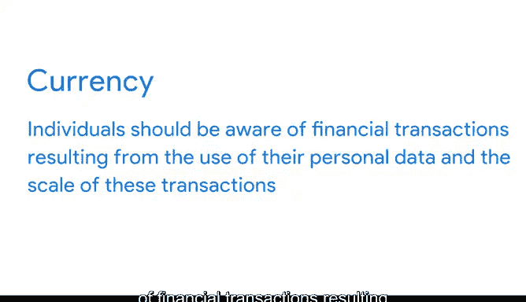

# 016：为数据探索做准备 - 数据伦理基础 📊⚖️

在本节课中，我们将要学习数据伦理的基础知识。数据伦理是数据分析中至关重要的一环，它为我们收集、共享和使用数据提供了道德准则。理解这些原则，能帮助我们在处理数据时做出更负责任、更公平的决策。

---

## 什么是伦理？

上一节我们介绍了课程主题，本节中我们来看看“伦理”的一般概念。伦理是一套指导人们生活的准则。大多数人都有个人道德准则来帮助自己在世界中行事。

年轻时，伦理可能很简单，例如“永不撒谎、欺骗或偷窃”。但随着年龄增长，它演变成一个更广泛的“可为与不可为”的清单。我们的个人伦理会发展并变得更加理性，为我们面对生活中的问题、挑战和机遇时提供一种道德指南针。

---

## 从个人伦理到数据伦理

当我们分析数据时，同样会面临问题、挑战和机遇。但我们不能仅仅依赖个人道德准则来解决它们。正如之前所学，我们都有个人偏见，更不用说那些让伦理问题更难处理的潜意识偏见了。

因此，我们有了**数据伦理**。这是分析学的一个重要方面，我们将在本视频中探讨。

首先，让我们回到伦理的一般概念。虽然哲学界对其确切定义仍有讨论，但一个实用的观点是：**伦理指的是关于对错的、有充分依据的标准，它规定了人类应当做什么，通常涉及权利、义务、社会利益、公平或特定美德**。

和数据一样，数据也有需要遵守的标准。**数据伦理指的是关于对错的、有充分依据的标准，它规定了数据应如何被收集、共享和使用**。

由于大规模收集、共享和使用数据的能力相对较新，监管和治理这一过程的规则仍在发展中。数据隐私的重要性已得到全球各国政府的认可，并开始制定数据保护立法来帮助保护人们及其数据。欧盟的《通用数据保护条例》（GDPR）正是为此而生。

在政策制定者继续工作的同时，像谷歌这样的公司有责任引领这一努力，并将一如既往地提供让隐私对每个人成为现实的产品。

数据伦理的概念，以及与透明度和隐私相关的问题，都是这一过程的一部分。数据伦理试图探究公司在保护并负责任地使用其收集的数据方面，应承担何种责任的根本问题。

---

## 数据伦理的六个核心方面

数据伦理包含许多不同方面，但我们将重点介绍以下六个：**所有权**、**交易透明度**、**同意**、**货币价值**、**隐私**和**开放性**。我们稍后会探讨隐私和开放性。首先从所有权开始。

以下是数据伦理的六个核心方面：

### 1. 所有权
这回答了“谁拥有数据”的问题。拥有数据的并非投入时间和金钱进行收集、存储、处理和组织的机构。**提供原始数据的个人才拥有数据的所有权**，他们对数据的使用、处理和共享方式拥有主要控制权。

### 2. 交易透明度
这个概念是指，所有的数据处理活动和算法，都应当能够被提供数据的个人完全理解和解释。这是为了回应之前讨论过的对**数据偏见**的担忧。

**数据偏见**是一种系统性地使结果偏向某个方向的错误。有偏见的结果可能导致负面后果。因此，为了避免这种情况，提供透明的分析非常有帮助，尤其是对那些共享数据的人。这能让人们判断结果是否公平、无偏见，并允许他们提出潜在的担忧。

### 3. 同意
这是数据伦理的另一个方面。**同意是指个人在同意提供数据之前，有权明确了解其数据将如何及为何被使用的具体细节**。

他们应该知道诸如“数据为何被收集？”、“将如何使用？”、“将存储多久？”等问题的答案。给予同意的最佳方式可能是数据提供者与数据请求者之间的对话。但在当今大量活动发生在线上时，同意通常只表现为一个带有更多详情链接的“条款与条件”复选框。

必须承认，并非每个人都会点击阅读那些细节。同意之所以重要，是因为它能防止所有人群受到不公平的针对性对待，这对于经常被有偏见的数据不成比例地错误代表的边缘化群体来说，是一件非常重要的事。

### 4. 货币价值
个人应该意识到，因其个人数据的使用而产生的金融交易以及这些交易的规模。因此，**如果你的数据正在帮助资助公司的某项努力，你应该了解这些努力是关于什么的，并有机会选择退出**。

### 5. 隐私与开放性
数据伦理的最后两个方面——**隐私**和**开放性**，值得在这个数据舞台上拥有自己的聚光灯。接下来，你将明白原因。

---

## 总结

本节课中，我们一起学习了数据伦理的基础知识。我们探讨了伦理的一般概念，并将其引申到数据领域，定义了数据伦理。我们详细介绍了数据伦理的六个核心方面：**所有权**、**交易透明度**、**同意**、**货币价值**、**隐私**和**开放性**。理解这些原则是成为一名负责任的数据分析师的关键第一步，它能确保我们在利用数据创造价值的同时，始终尊重和保护数据提供者的权利与利益。