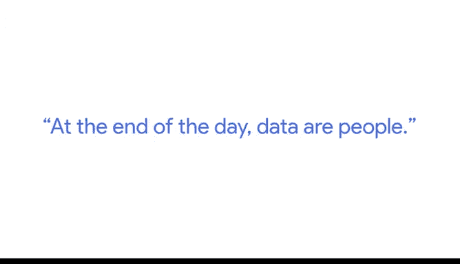

# 017：数据伦理的重要性

在本节课中，我们将学习数据伦理的核心概念。数据伦理不仅关乎技术操作，更关乎数据如何与社会互动，以及如何影响人们的生活。理解并实践数据伦理，是每一位数据分析师和科学家的基本责任。

上一节我们介绍了数据探索的准备流程，本节中我们来看看数据伦理这一至关重要的维度。

我是Alex，是谷歌的一名研究科学家。我的团队名为“伦理人工智能团队”。我们不仅关注人工智能和技术如何运作，更关心它如何与社会互动，以及它可能如何帮助或伤害边缘化群体。

当我们谈论数据伦理时，我们思考的是：什么是使用数据的正确与良好方式？哪些数据使用方式将对人们有益？数据伦理不仅关乎最小化伤害，更关乎“行善”这一概念——我们如何通过使用数据来切实改善人们的生活。

当我们思考数据伦理时，我们需要考虑：
*   **谁**在收集数据？
*   **为什么**收集数据？
*   **如何**收集数据？
*   收集数据是**为了什么目的**？

由于组织通常有盈利、汇报或提供分析的需求，我们也必须时刻牢记：这一切最终将如何真正使人们受益？数据中所代表的人们会因此受益吗？我认为，这是作为数据科学家或数据分析师永远不应忽视的一点。

以下是数据伦理实践中需要牢记的几个关键原则：

首先，数据即人。有抱负的数据分析师需要记住，你将遇到的大量数据都来源于人。因此，归根结底，**数据即人**。你对那些在数据中被代表的人们负有责任。

其次，思考如何保护数据的隐私性。在我们的实践中，不能将数据实例视为可以随意抛到网上的东西。必须考虑如何保护这些信息及其相似物（如图像、声音或文本）的隐私。

此外，我们需要思考如何建立机制，赋予用户和消费者对其数据的更多控制权。仅仅说“我们收集了所有这些数据，请相信我们”是不够的。我们必须确保存在可行的方式，让人们能够同意提供数据，并能够要求撤销或删除这些数据。

因此，在数据不断增长的同时，我们需要赋予人们控制自己数据的能力。未来的趋势是数据将持续增长，我们尚未看到任何数据会减少的迹象。随着数据的增长，这些问题将变得越来越突出，思考它们也变得越来越重要。

本节课中我们一起学习了数据伦理的核心要义：数据背后是人，我们的工作负有对“人”的责任。这要求我们在收集、处理和分析数据时，始终将受益性、隐私保护和用户控制权作为基本原则。牢记这些，是成为一名负责任的数据从业者的第一步。