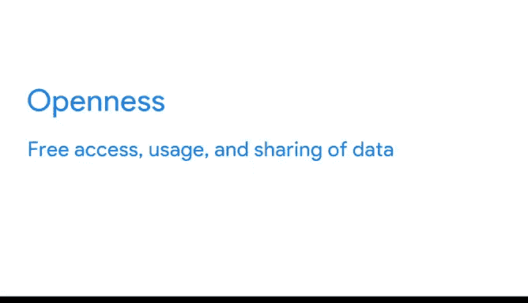

# 018：谷歌数据分析师第三课《为数据探索做准备》- 数据隐私优先 🛡️

在本节课中，我们将深入探讨数据伦理中的一个核心且个人化的领域：**数据隐私**。我们将了解数据隐私的定义、其重要性、个人权利以及企业在保护数据方面的责任。

---

上一节我们介绍了数据伦理的多个方面，本节中我们来看看其中最关乎个人的一个领域：**隐私**。

隐私是个人化的。我们可能都以自己的方式定义隐私，并且我们都有权享有它。无论是家庭成员在使用共享电脑时需要隐私，青少年只想与特定的人分享自拍，还是公司希望保护客户的信用卡信息安全，我们都关心自己的数据如何被使用和共享。

在当今文化中，数据隐私至关重要，因此让我们全面探讨它。

谈论数据隐私，意味着在**任何数据交易发生时，保护数据主体的信息和活动**。这有时被称为信息隐私或数据保护。它关乎数据的**访问、使用和收集**。它也涵盖个人对其数据的合法权利。

这意味着像你我这样的人，其私人数据应受到保护，免受未经授权的访问；应享有数据不被滥用的自由；拥有检查、更新或更正数据的权利；能够同意他人使用我们的数据；并拥有访问自身数据的合法权利。

对于公司而言，这意味着**实施隐私保护措施**以保护个人数据。

数据隐私非常重要，即使你并非每天都思考这个问题。数据隐私的重要性已得到全球各国政府的认可，并已开始制定数据保护立法，以帮助保护人们及其数据。

能够信任公司处理你的数据至关重要。正是这种信任，才让人们愿意使用公司的产品、分享他们的信息等等。信任是一项重大的责任，不容轻视。

涉及数据伦理的最后一个方面是**开放性**，即数据的自由访问、使用和共享。我们将在另一个视频中讨论这一点。

你正在成为一名有道德的数据分析师的道路上稳步前进。

---

本节课中，我们一起学习了数据隐私的核心概念。我们明确了数据隐私的定义，它关乎个人信息的保护以及在数据交易中的权利。我们了解到，个人拥有免受未经授权访问、数据不被滥用、以及控制自身数据的多项权利。同时，企业有责任建立措施来保护用户数据，而建立信任是这一切的基础。理解并优先考虑数据隐私，是每一位数据分析师职业素养的重要组成部分。