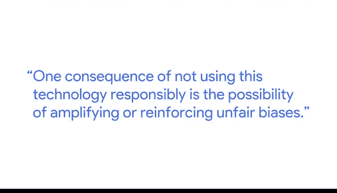
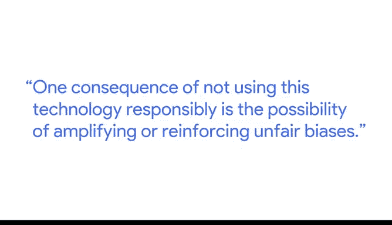

# 019：19_02_05_Andrew_数据的伦理使用.zh_en - GPT中英字幕课程资源 - BV19X4y1n7Xd

## 🧭 课程概述

在本节课中，我们将要学习数据与人工智能的伦理使用。课程由谷歌伦理人工智能研究组的高级开发者倡导者Andrew主讲，他将解释负责任地使用数据和技术的重要性，以及不这样做可能带来的风险。

---

## 🤖 引言：技术的社会责任

我的名字是Andrew。我是谷歌伦理人工智能研究组的一名高级开发者倡导者。作为一名高级开发者倡导者，我致力于帮助更广泛的社区构建对社会负责的人工智能系统。

不负责任地使用这项技术的一个后果，是可能放大或强化不公平的偏见。

---

## ⚖️ 算法与决策的影响

上一节我们介绍了技术的社会责任，本节中我们来看看算法在现实世界中的应用及其影响。

现在，这些算法和数据集经常被用于决定结果的场景中。无论是为个人筛选内容，还是决定他们是否有资格获得贷款，所有这些不同的决策过程都依赖于在该背景下使用的算法和数据集。

因此，如果处理不当，这些系统的结果可能会对代表性不足的社区和少数群体造成潜在伤害。

---

## 🌱 行业与社区的持续学习

关于数据和人工智能的负责任使用，该领域、行业和社区正在学习很多内容。我尝试做的事情，是整理所有这些不同的要素。

以下是这些要素的具体内容：

*   与谷歌内部的各种研究小组合作。
*   与谷歌内部的各种产品团队合作。
*   与更广泛的社区互动。

我们必须超越常规，去教育那些致力于为善而构建这项技术，但可能不一定拥有资源或机构社区智慧来真正实现其良好意图的人们。

---

## 💡 技术的益处与集体责任

事情的真相是，人工智能、数据以及围绕它们构建的任何技术都带来了巨大的益处。它正在改善许多人的生活，使我们能够做到以前无法做到的事情，为我们提供了思考生活中其他事情的便利。

这更说明了我们集体共同努力的重要性，不仅仅是一个组织，而是整个社区，甚至是非技术人员，每个人都需要参与进来。这就是我在这里扮演的角色：我努力帮助人工智能在伦理的轨道上共同演进。

而要做到这一点，取决于人工智能负责任使用的民主化。

---

## 📚 课程总结

本节课中我们一起学习了数据伦理使用的核心概念。我们了解到，算法和数据集在关键决策中扮演着重要角色，其不当使用可能加剧社会不公。同时，整个行业和社区都在积极学习如何负责任地使用AI，这需要开发者、研究团队乃至公众的集体参与和努力。最终，负责任地使用技术不仅能带来巨大益处，也是技术持续健康发展的基石。