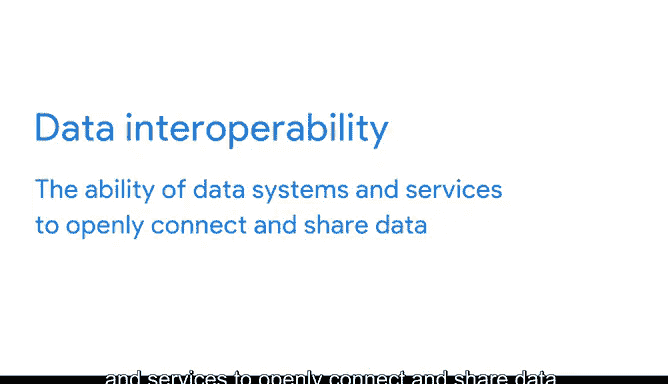

# 020：谷歌数据分析师第三课《为数据探索做准备》data-preparation 📚

## 课程概述

在本节课中，我们将要学习**开放数据**的概念、特征及其重要性。我们将探讨开放数据的定义、核心标准、优势与挑战，并理解它如何赋能数据分析师的工作。

---

## 开放数据的定义与核心标准 🗂️

上一节我们介绍了数据伦理的多个方面，本节中我们来看看**开放性**。

当提及数据时，**开放性**指的是对数据的**免费访问、使用和共享**。我们有时称之为**开放数据**。但这并不意味着我们可以忽略之前讨论过的数据伦理的其他方面。我们仍需保持透明、尊重隐私，并确保对他人拥有的数据已获得使用许可。这仅意味着，如果数据符合高标准，我们就可以访问、使用和共享它。

开放数据通常遵循几项核心标准，以下是其主要方面：

*   **可用性与访问性**：开放数据必须作为一个整体提供，最好能通过互联网以便利且可修改的形式下载。
    *   **示例**：网站 `data.gov` 就是一个很好的例子。你可以下载各行各业的科学与研究数据，文件格式简单，如电子表格。
*   **重用与再分发**：开放数据必须在允许重用和再分发的条款下提供，包括将其与其他数据集结合使用的能力。
*   **普遍参与性**：每个人都必须能够使用、重用和再分发数据。不应存在对任何领域、个人或群体的歧视。任何人都不能对数据施加限制，例如规定其仅可用于特定行业。

---

## 开放数据的优势与影响 ✨

了解了开放数据的标准后，我们来看看它为何如此重要。

开放数据最大的好处之一是，可信的数据库可以得到更广泛的应用。更重要的是，所有优质数据都可以被**利用、共享并与其他数据结合**。

想象一下，这将对科学合作、研究进展、分析能力和决策制定产生多大的影响。

以下是开放数据带来积极影响的具体领域：

*   **在人类健康领域**：开放性使我们能够访问并结合多样化的数据，从而更早地检测疾病。
*   **在政府治理领域**：它有助于让领导者承担责任，并为社区服务提供更好的访问渠道。
其可能性和益处几乎是无穷无尽的。

---

## 开放数据面临的挑战 ⚠️

当然，每一个伟大的构想都面临挑战。

向开放数据进行技术转型需要大量的资源。**互操作性**是开放数据成功的关键。**互操作性**是指数据系统和服务能够公开连接和共享数据的能力。

例如，数据互操作性对于医疗信息系统至关重要。医院、诊所、药房和实验室等多个组织需要访问和共享数据，以确保患者获得所需的护理。这就是为什么你的医生能够将处方直接发送给药房配药——他们拥有允许共享信息的兼容数据库。

但这种互操作性需要大量的合作。尽管开放、及时、公平和简单的数据共享具有巨大的潜力，但其未来将取决于如何有效应对更广泛的挑战。

作为一名数据分析师，我认为**越早实现越好**。说到这个，我们将在接下来的视频中更详细地讨论开放数据，并观察其实际应用。

---

## 课程总结 🎯

本节课中，我们一起学习了**开放数据**的核心概念。我们明确了开放数据的定义，了解了其必须遵循的**可用性、重用性和普遍参与性**标准。我们探讨了开放数据在促进协作、推动研究和服务社会方面的巨大优势，同时也认识到实现它所需的**技术转型**和**互操作性**挑战。现在，你已经掌握了关于数据伦理的重要原则，可以在你的数据之旅中指导你。任何时候你对数据不确定，请记住你在这里学到的东西。