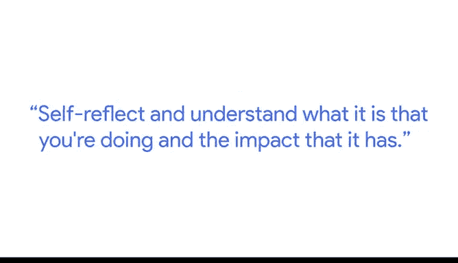

# 021：伦理数据使用步骤 🧭

在本节课中，我们将学习数据分析师在评估数据集时应遵循的伦理步骤，以确保从多个伦理视角审视数据，并负责任地使用数据。

我的名字是安德鲁，我是谷歌伦理人工智能研究小组的一名高级开发者倡导者。作为一名分析师，在评估数据集时，你可以做很多事情，以确保你通过不同的伦理视角来审视它。

## 自我反思与理解影响 🤔

上一节我们介绍了伦理审视的重要性，本节中我们来看看具体步骤。首先，你需要进行自我反思，理解你正在做的事情及其可能产生的影响。

挑战固有思维的最佳方式是质疑我们自身。例如，我们团队试图构建这个，是因为我们认为它将有助于改进产品，或将为我们下一步的决策提供信息。

## 考虑数据内外的群体 👥

以下是进行伦理思考时需要扩展的视角范围：
*   不仅要考虑与你并肩工作的同事。
*   也要考虑数据中所代表的群体。
*   同时考虑数据中未被代表的群体。

然后，利用这种直觉继续质疑数据的完整性、质量和代表性。接着，思考与你工作相关的各种潜在危害和风险。

## 评估数据风险与危害 ⚠️

例如，如果你认为保留数据更长时间会带来益处，你可能也需要理解持有这些数据的风险。如果你持续查看、存储和检索这些数据，可能会产生什么潜在的危害？

## 审视数据收集与沟通流程 📢

更进一步，还需要理解数据收集的同意流程是怎样的。你是否告知了数据提供者数据将如何被使用？沟通渠道是怎样的？这些都是应用不同伦理视角时需要关注的问题。

## 负责任地呈现与使用数据 📊

通过对分析采取更细致入微的方法，意识到不仅在分析数据集时，而且在呈现数据、描绘结果、以及在决策过程中如何使用这些结果时，所有可能出现的风险和危害。

无论你是向管理层、高管还是更广泛的受众呈现这些数据，所有这些在负责任地使用数据方面都至关重要。

## 数据分析师的关键角色 ⚖️

作为数据分析师，你站在一个关键的交汇点上：一边是可能从正在开发的技术中受益的人群，另一边是你组织中那些试图做出更明智决策，以决定是否将该项技术投入生产的人。

这可能让人感觉责任重大，事实也确实如此。但这同时也非常关键，它恰恰说明了你的工作所能产生的巨大影响。

---

本节课中我们一起学习了伦理数据使用的核心步骤：从自我反思开始，扩展考虑所有相关群体，评估数据风险，审视收集流程，并最终以负责任的方式呈现和使用数据。作为数据分析师，理解并践行这些步骤对于确保技术的公平、公正发展至关重要。