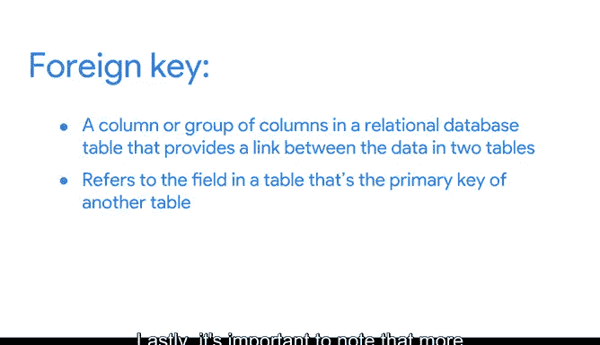

# 023：23_03_02_数据库特性与组件.zh_en

## 📚 课程概述

在本节课中，我们将要学习数据库的核心特性与组件。数据库是数据分析师不可或缺的工具，理解其内部结构对于高效管理和访问数据至关重要。我们将重点介绍关系型数据库、表之间的关系，以及主键与外键这两个核心概念。

---

## 🏗️ 数据库简介与结构

数据库是存储和组织数据的工具，它使数据分析师能够更轻松地管理和访问信息。数据库帮助我们更快地获取洞察、做出数据驱动的决策并解决问题。

你已经对数据库是什么以及数据分析师如何使用它们有了一些了解。现在，让我们更深入地学习数据库的特性和组件。

以下是一个简单的数据库结构示例，它包含一个汽车制造商的信息表。

数据库的顶层包含汽车经销商、产品详情和维修零件等表。当你选择其中一个表并深入下一层时，你会找到每个项目的更具体细节。

---

## 🔗 关系型数据库

这种结构被称为**关系型数据库**。关系型数据库包含一系列相互关联的表，这些表可以通过它们之间的关系连接起来。

为了让两个表建立关系，它们内部必须存在一个或多个相同的字段。

例如，在这个结构中，`branch_ID` 字段同时存在于这个表和那个表中。

如果一个字段同时存在于两个表中，我们就可以用它来将这两个表连接起来。`branch_ID` 字段就是连接这些表的关键。

---

## 🔑 理解主键与外键

有两种类型的关键字段：主键和外键。

### 主键

**主键**是一个标识符，它引用一个每一行值都唯一的列。你可以将其视为表中每一行的唯一标识符。

在我们的经销商信息表中，`Branch_ID` 是主键。

同样，在每辆车的产品详情表中，`VIN` 是我们的主键。

作为分析师，你可能需要创建表。如果你决定包含一个主键，它必须是唯一的，这意味着没有两行可以拥有相同的主键。此外，它不能为空或空白。

### 外键

还有**外键**。外键是表中的一个字段，它是另一个表中的主键。

换句话说，外键是一个表连接到另一个表的方式。

因为我们的维修零件表包含每个汽车零件的信息，所以主键是 `part_ID`。维修零件表中的每一行代表一个唯一的零件。该表中的所有其他键，例如 `VIN`，都是外键，它们允许维修零件表连接到其他表。

如你所见，一个表只能有一个主键，但可以有多个外键。

---

## 📝 核心概念总结

理解主键和外键可能有些棘手，但后续你将有很多机会进行练习。以下是一个概括性的总结：

*   **主键**：用于确保特定列中的数据是唯一的。它唯一地标识关系数据库表中的一条记录。一个表中只允许有一个主键，并且它们不能包含空值或空白值。
    *   **公式/代码描述**：`PRIMARY KEY (column_name)`
*   **外键**：关系数据库表中的一个列或一组列，用于在两个表的数据之间提供链接。它引用一个表中的字段，该字段是另一个表的主键。
    *   **公式/代码描述**：`FOREIGN KEY (column_name) REFERENCES other_table(primary_key_column)`

最后，需要注意的是，一个表中允许存在多个外键。

---

## 🎯 课程总结与展望

在本节课中，我们一起学习了数据库的基本结构、关系型数据库的概念，以及主键与外键的定义、区别和作用。主键是表的唯一标识，而外键是表间建立联系的桥梁。

你可以随时重看本视频，以确保你清楚地理解了主键和外键。接下来，你将开始练习如何访问和分析实际数据库中的数据，这将是一个绝佳的机会，来加深你对主键、外键、数据库组织方式的理解，以及思考如何在未来的分析职业生涯中使用数据库。

