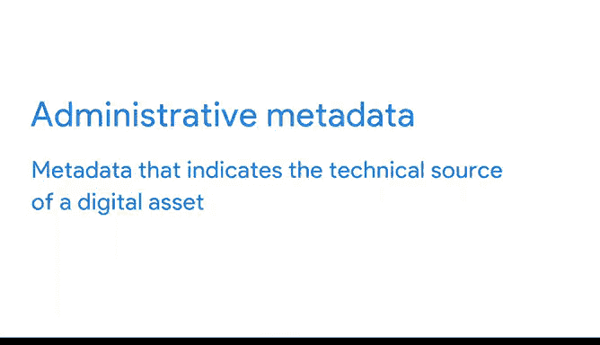

# 024：揭秘元数据

在本节课中，我们将要学习一个数据库管理中的核心概念——**元数据**。我们将了解什么是元数据，它在数据分析中的重要性，以及数据分析师在工作中会遇到的三种主要元数据类型。

---

现在你已经了解了在数据库中组织数据的不同方式，接下来我们来探讨如何描述这些数据。在本视频中，我们将开始探索**元数据**，这是数据库管理的一个非常重要的方面。

元数据是一个比较抽象的概念，因此让我们从一个简单的日常例子开始。你是否知道，每次用智能手机拍照时，数据都会被自动收集并存储在那张照片中？你可以自己查看一下：在电脑上选择任意一张照片。这里有一张我朋友的小狗 Rudy 和 Matilda 的可爱照片。在你的照片上，右键点击并选择“获取信息”或“属性”。

这将为你提供照片的**元数据**，它可能会告诉你文件的类型、拍摄的日期和时间、地理位置（拍摄地点）、用于拍摄的设备类型等等。非常神奇，对吧？

以下是另一个例子。每次你发送或接收电子邮件时，**元数据**也会随消息一起发送。你可以通过点击“显示原始邮件”或“查看邮件详情”来找到它。一封电子邮件的元数据包括其主题、发件人、收件人、发送日期和时间。元数据甚至知道在发件人按下发送键后，邮件被投递的速度有多快。

---

好的，所以**元数据**是用来描述诸如照片或电子邮件中所包含数据的信息。请记住，元数据**不是**数据本身，而是**关于数据的数据**。在数据分析中，元数据帮助数据分析师解读数据库内数据的内容。这就是为什么在处理数据库时，元数据如此重要——它告诉分析师数据的全部信息，从而使得利用数据解决问题和做出数据驱动的决策成为可能。

---

作为一名数据分析师，你会遇到三种常见的元数据类型：**描述性元数据**、**结构性元数据**和**管理性元数据**。

以下是这三种类型的详细介绍：

*   **描述性元数据**：这种元数据描述一条数据，并可用于在以后识别它。例如，图书馆中一本书的描述性元数据将包括你在书脊上看到的代码（称为唯一的国际标准书号，即 **ISBN**），以及书的作者和标题。
*   **结构性元数据**：这种元数据指示一条数据是如何组织的，以及它是否属于一个或多个数据集合。让我们回到图书馆的例子，结构性数据的一个例子就是书页如何组合在一起形成不同的章节。值得注意的是，结构性元数据还会跟踪两个事物之间的关系。例如，它可以向我们展示一本书稿的数字文档实际上是现在印刷版书籍的原始版本。
*   **管理性元数据**：这种元数据指示数字资产的技术来源。当我们查看照片内部的元数据时，那就是管理性元数据。它向你展示了文件的类型、拍摄的日期和时间等等。

---

最后，有一个想法可以帮助你理解元数据：如果你正要去图书馆挑选一本书，你可以研究一本书的标题、作者、长度、章节数量——这些都是**元数据**，它能告诉你很多关于这本书的信息。但是，你必须真正**阅读**这本书才能知道它的具体内容。同样，你可以阅读关于数据分析的知识，但你必须**学习这门课程**才能获得谷歌数据分析师证书。所以，请继续前进，以获得新的视角。

---

本节课中我们一起学习了**元数据**的概念及其重要性。我们了解到元数据是“关于数据的数据”，它能帮助我们理解和组织信息。我们还详细探讨了数据分析师在工作中会遇到的三种主要元数据类型：**描述性**、**结构性**和**管理性**元数据。掌握元数据是有效管理和分析数据的关键一步。