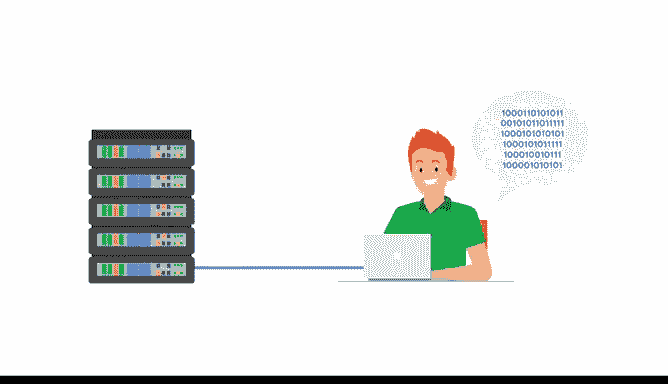

# 025：谷歌数据分析师第三课《为数据探索做准备》 📊

## 课程概述

在本节课中，我们将要学习元数据及其在数据管理中的核心作用。我们将了解元数据如何帮助组织创建单一事实来源，确保数据质量，并探索元数据专家的日常工作。

---

## 元数据与数据管理 🗂️

上一节我们讨论了数据准备的重要性，本节中我们来看看元数据如何作为分析师工具箱中的强大工具。

元数据和元数据存储库是数据分析师工具箱中非常强大的工具。正如我们之前讨论的，数据分析师使用它们来创建单一事实来源。它们能保持数据的一致性和统一性，并确保我们处理的数据是准确、精确、相关和及时的。这些工具还通过标准化我们的流程，使数据的访问和使用变得更加容易。

在本视频中，我们将探索元数据的更多组成部分，并学习元数据分析师如何工作以保持事物的条理性。

---

## 数据管理的挑战与元数据的解决方案 🔍

我们知道，数据的数量在不断增长，但许多企业并没有充分利用他们的数据。有时他们不知道自己拥有什么数据，有时他们找不到数据，或者有时企业根本不信任这些数据，尤其是在大公司中。

数据可能跨越众多不同的流程和系统，从这么多地方汇集数据可能是一个巨大的挑战。例如，假设一家公司最初在其办公室使用传统的数据存储系统。但随着其拥有的数据量持续扩张，也需要云存储。此外，这家公司还可能从合作伙伴组织访问和使用第二方或第三方数据。

这些系统中的每一个都有其自身的规则和要求。因此，每个系统都以完全不同的方式组织数据，增加了更多的复杂性。难怪这么多组织难以在正确时刻找到正确的数据。

另一方面，元数据存储在单一的中央位置，为公司提供关于其所有数据的标准化信息。这通过两种方式实现：

以下是元数据实现标准化的两种方式：
*   **第一**，元数据包含关于每个系统位于何处以及数据集在这些系统内位于何处的信息。
*   **第二**，元数据描述了所有数据在不同系统之间是如何连接的。

---

## 数据治理：元数据的重要方面 ⚖️

元数据的另一个重要方面是所谓的**数据治理**。

**数据治理**是确保公司数据资产得到正式管理的过程。这使组织能更好地控制其数据，并帮助公司管理与数据安全、隐私、完整性、可用性以及内部和外部数据流相关的问题。

需要指出的是，数据治理不仅仅是标准化术语和程序。它关乎每天处理元数据的人员的角色和职责。这些人就是元数据专家，他们组织和维护公司数据，确保其尽可能达到最高质量。

以下是元数据专家的主要职责：
*   创建基本的元数据标识和发现信息。
*   描述不同数据集协同工作的方式。
*   解释许多不同类型的数据资源。
*   创建每个人都遵循的非常重要的标准，以及用于组织数据的模型。

---

## 元数据分析师的角色 🤝

无论他们在科技公司、非营利协会还是金融机构工作，元数据分析师都有一个共同点：他们都是出色的团队合作者。他们热衷于通过与同事和其他利益相关者分享数据来使数据变得可访问。

因此，如果你正在寻找一个鼓励你探索数字世界所提供的一切数据的角色，那么选择成为元数据分析师的道路可能是一个正确的选择。

---

## 课程总结

本节课中我们一起学习了元数据在数据管理中的核心价值。我们了解到，元数据通过提供数据的标准化信息和连接关系，帮助解决数据分散和复杂的挑战。数据治理框架和元数据专家在其中扮演着关键角色，他们确保数据资产的质量、安全与可用性。无论企业规模大小，在面临市场趋势和竞争时，数据分析都能帮助他们回答关键问题并持续改进。