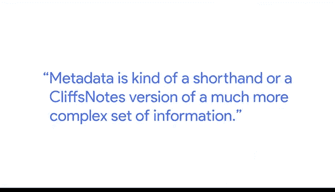
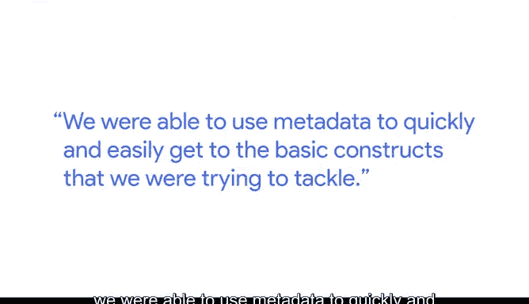
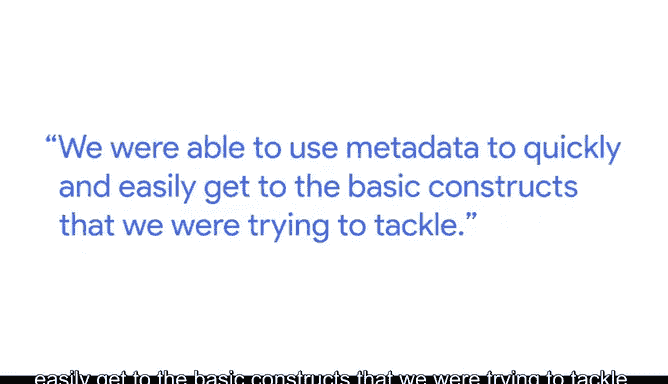

# 026：谷歌数据分析师第三课《为数据探索做准备》 📊

在本节课中，我们将学习元数据的概念及其在数据分析项目中的关键作用。元数据是理解大型数据集的钥匙，它能帮助我们高效地探索数据、规划项目并与团队有效沟通。

---

我叫梅根，是谷歌的代理测量负责人。我的主要工作是帮助广告代理机构揭开测量和分析的神秘面纱。我的服务对象包括那些负责为广告主执行媒体计划的人，以及那些对衡量媒体为客户带来的影响感兴趣的人。

我从事这项工作大约17年了。在此期间，我见证了该领域的诸多演变，包括数据可用性的提升，以及各种建模技术变得更加先进和易于使用。看到分析如何变得更加主流，以及人们如何对它越来越感兴趣，这是一段非常酷的旅程。

## 什么是元数据？ 🔑

元数据本质上是**更大数据集的钥匙**。它有助于描述你将处理的数据中行和列所包含的内容。元数据可以看作是一个更复杂信息集合的**简写或“线索”版本**。

## 元数据的作用与价值 💡

上一节我们定义了元数据，本节中我们来看看它的具体作用。

它有助于你掌握单个可能访问的数据集中包含的内容。在任何分析项目的探索阶段，元数据都是一个重要部分。当你与客户或供应商合作时，它帮助你理解可用于解决问题的资源，以及可能缺失的部分。它以一种简单直接的方式为你提供了**解锁数据的钥匙**，并且是一个极佳的沟通工具。

## 元数据在实际项目中的应用案例 🏗️

理解了元数据的基础价值后，我们通过一个实际案例来看看它如何解决复杂问题。

当我为一家广告主工作时，我们尝试构建一个所谓的**数据湖**。本质上，这是将分析中可能想使用的所有数据源汇集到一个地方，这可能会非常棘手。

元数据的好处之一是帮助我们找出数据源可能重叠的地方，找出有共同之处的数据源，以及我们从每个数据集中获得的独特信息片段。因此，当我们思考如何应对这个庞大而重要的项目时，我们能够利用元数据快速、轻松地触及我们试图解决的基本结构。

## 元数据在团队协作中的意义 🤝

除了技术层面的应用，元数据在促进团队理解与合作方面也扮演着关键角色。

当你与那些可能不以分析为日常工作的人合作时，让他们获得“顿悟”时刻，帮助他们理解测量和分析是如何帮助他们实现目标的工具，这一点非常重要。能够将之前难以理解的东西变得对该团队更易理解，让他们感到可以放心地付诸实践，这非常重要，也是一种极佳的合作成果。

---

**本节课总结**：本节课我们一起学习了元数据的概念。我们了解到，元数据是描述数据的数据，它像一把钥匙，能帮助我们快速理解数据集的结构、发现数据源间的关联与差异，并作为有效的沟通工具，促进团队协作，让复杂的数据信息变得更容易被非技术人员理解和应用。