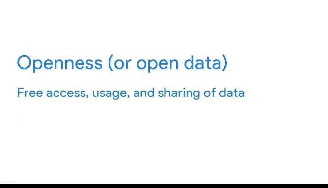

# 027：数据分析师课程第三课《为数据探索做准备》📊

在本节课中，我们将学习数据分析师如何从不同渠道获取数据。了解数据的来源是数据分析工作的第一步，它决定了后续分析的基础和质量。

## 内部数据与外部数据

上一节我们介绍了数据分析的基本流程，本节中我们来看看数据的两种基本类型：内部数据和外部数据。

内部数据是指存在于公司自身系统内的数据，通常由公司内部生成。内部数据有时也被称为**主要数据**。

外部数据是指在组织外部存在和生成的数据。它可以来自多种渠道，包括其他企业、政府机构、媒体、专业协会、学校等。外部数据有时被称为**次要数据**。

## 内部数据的获取与价值

根据数据分析项目的需求，收集内部数据可能比较复杂。你可能需要从多个不同来源和部门获取数据，包括销售、营销、客户关系管理、财务、人力资源甚至数据档案库。

但这份努力是值得的。内部数据对企业有许多优势：
*   它提供的信息与你试图解决的问题直接相关。
*   由于公司已经拥有这些数据，因此访问是免费的。

凭借内部数据，分析师可以在不超出公司范围的情况下处理各种数据项目。但有时内部数据无法提供完整的图景。

## 外部数据的应用

在内部数据不足的情况下，数据分析师可以转向外部数据，并将这些信息应用于分析中。

例如，作为医疗保健分析师，我们经常与其他医疗保健组织或非营利组织合作，利用他们的数据进行更深入的分析，并增加更宏观的行业视角。

## 开放数据倡议

在之前的视频中，你了解到开放性通过开放数据倡议为分析师创造了大量可用数据。重申一下，**开放性**或**开放数据**指的是数据的免费访问、使用和共享。

例如，美国政府通过 `data.gov` 网站向公众提供了数十万个数据集。

以下是这些开放数据倡议的几个目的：
*   提高政府活动的透明度，例如让公众了解资金的使用去向。
*   帮助公民了解投票和本地议题。
*   通过让人们参与公共规划或向政府提供反馈来改善公共服务。
*   通过帮助个人和公司更好地理解他们的市场，从而推动创新和经济增长。

## 公共数据库示例

谷歌实际上托管了许多公共数据库，包含科学、交通、经济、气候等领域的信息。

例如，一家共享单车公司可以使用我们公共交通数据库中的交通数据来查看哪些道路最繁忙，然后选择这些地点投放单车，以减少道路上的汽车数量，并为人们提供另一种交通选择。

## 总结

本节课中我们一起学习了内部数据和外部数据的区别、各自的获取方式以及价值。你现在已经熟悉了内部和外部数据以及如何访问它们。接下来，我们将学习如何将你从不同来源收集的所有数据导入到电子表格中。