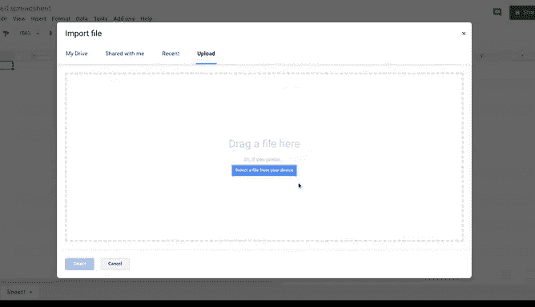
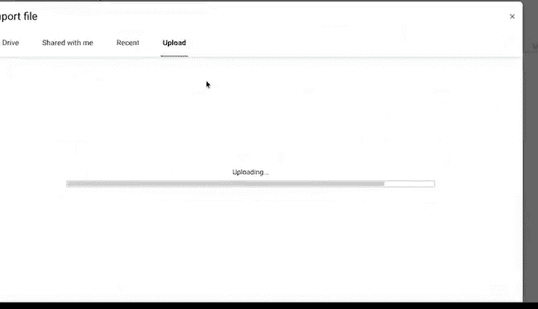
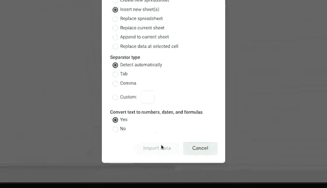
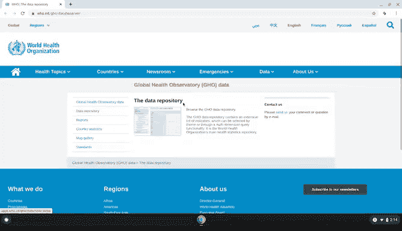
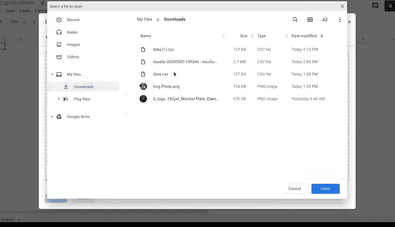
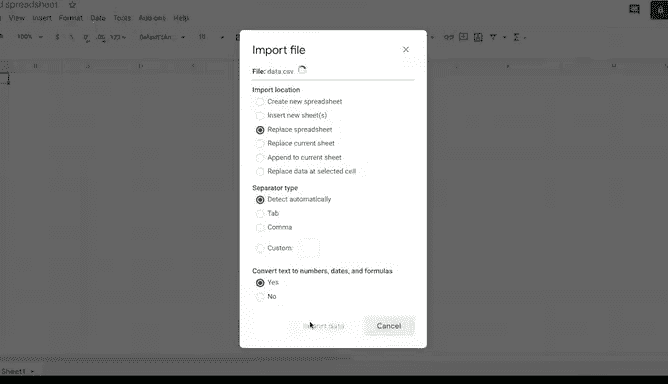

# 028：谷歌数据分析师第三课《为数据探索做准备》 📊

在本节课中，我们将学习如何从电子表格和数据库等不同来源实际导入数据。你已经了解了内部和外部数据以及如何准备它们，现在我们将进入实际操作阶段。

## 从电子表格导入数据 📁

上一节我们介绍了数据准备的基本概念，本节中我们来看看如何从本地文件导入数据。

有时你需要从文件中上传电子表格，例如CSV文件。CSV代表逗号分隔值，这种文件以表格格式保存数据。现在，让我们将这样一个文件导入到一个新的电子表格中。

以下是操作步骤：

1.  选择“文件”，然后选择“导入”。
2.  选择“上传文件”。
3.  导航到文件位置。
4.  打开文件并将其作为新工作表插入。

## 理解CSV文件格式 🔍

CSV文件使用纯文本，并通过特定字符进行分隔。

在导入时，每一列或字段都通过分隔符清晰地区分开来。正如你所知，CSV是逗号分隔的，通常电子表格应用会自动检测这些分隔符。

但有时你可能需要在此窗口中通过选择不同选项来指明分隔符是另一个字符或空格。

此外，如果你计划处理该数据集，通常需要将数据转换为文本、数字或其他格式，但对于报告目的，纯文本格式即可。因此，我们可以保留这些字段的默认设置。最后，选择“导入数据”。

现在，我们的CSV文件已准备好在电子表格中使用了。

## 实际应用场景：医疗数据分析 🏥

我大部分工作时间都在分析包含医疗信息的电子表格。我通常从查看较大的数据集开始，然后将其子集提取到电子表格中进行处理。

例如，我可能想分析谷歌搜索中对某些医疗服务（如远程医疗）用户需求的逐年增长情况。或者，我可能希望查看来自外部医疗组织或机构的数据集，以更深入地了解这一趋势。

以远程医疗为例，我可能会查看一个列出远程医疗服务提供商的电子表格。电子表格能以多种方式帮助你找到所需的洞察。

## 从外部数据库导入数据：以WHO为例 🌐

我经常使用的一个数据源是世界卫生组织的数据仓库。这是一个任何人都可以访问开源数据的地方。正如你所见，这里有海量数据可用。

以下是查找数据的方式：

*   你可以按主题、类别、指标和国家进行搜索。
*   如果你想了解更多关于仓库中数据的信息，还可以访问世界卫生组织的元数据。

在我们的示例中，我们将查看按国家和年份统计的医生数据。这些信息对于数据分析项目非常有用，例如研究特定人口中可用于治疗患者的医生数量，并与其他人口进行比较。

以下是获取此数据的步骤：

1.  从包含所需数据的网页开始。
2.  将数据下载为CSV文件。
3.  打开一个新的电子表格，通过选择“文件”->“导入”来导入文件。
4.  上传你的文件并选择“导入数据”。

在检查数据确保其看起来整洁后，我们可以为其添加标题并开始工作。

## 总结与预告 📝

本节课中我们一起学习了如何从本地文件和外部数据库（如世界卫生组织仓库）导入CSV格式的数据。虽然信息量很大，但通过更多练习你会更加熟练。

我知道这需要消化很多信息，但你练习得越多，就会越得心应手。接下来，我们将学习如何对数据进行排序和筛选，以专注于与你相关的信息。😊