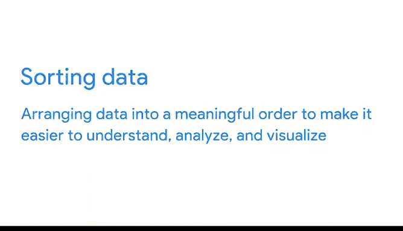
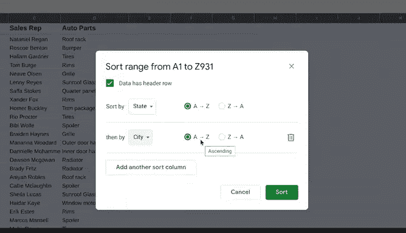

# 029：谷歌数据分析师第三课《为数据探索做准备》data-preparation 📊

## 课程概述

在本节课中，我们将学习如何通过排序与筛选来聚焦于与待解决问题相关的数据。当处理大型、复杂的电子表格时，这项技能至关重要，它能帮助我们从海量信息中快速定位和分析所需内容。

## 聚焦相关数据

在之前的视频中，你已经了解了内部和外部数据。现在，我将展示如何仅关注与你试图解决的问题相关的数据。

如果你正在处理一个非常庞大且复杂的电子表格，这项技能会非常有用。数据分析师经常遇到这种情况。拥有大量数据会使快速查找和分析所需信息变得困难。

没有两个分析项目是完全相同的。通常，数据分析师处理、查看和使用数据的方式也大相径庭，即使数据来自完全相同的来源。这里有一个例子。

请看这个显示公司销售代表及其工作地点的电子表格。

不同的数据分析师可能希望从这个电子表格中获得不同的信息，这时排序和筛选就派上用场了。

对电子表格中的数据进行排序和筛选有助于我们自定义数据的呈现方式。它们还能组织数据，使分析师能够聚焦于重要的部分。可以把它想象成我们数据的放大镜。

## 数据排序

让我们从排序开始。排序涉及将数据排列成有意义的顺序，以便于理解、分析和可视化。

数据可以按升序或降序、字母顺序或数字顺序进行排序。

排序可以在整个电子表格中进行，也可以仅在单个列或表格中进行。你还可以按多个变量进行排序。例如，如果我们的数据包含城市和州字段，我们可以先按城市排序，然后再按州排序。

任何时候对数据进行排序，首先冻结标题行总是一个好主意。为此，需要高亮显示该行。然后从“视图”菜单中选择“冻结”和“1行”。

这将锁定该行。现在，当我们向下滚动工作表时，标题行保持可见，因此我们知道每一列的类别。看起来不错，现在让我们对整个电子表格进行排序。

我们将首先按城市排序。为此，选择城市列。然后使用下拉箭头对工作表进行排序，选择“A到Z”。

这将根据所选列作为主要排序标准，将所有列按行从A到Z排序。城市现在按字母顺序排列，并且它们仍然与相应的州、销售代表和汽车零部件分组在一起。在排序特定部分时，每一行的详细信息会自动保持在一起，正如你在这里看到的。

多条件排序是另一个非常有用的数据分析工具。例如，假设我们想按销售代表工作的城市和州查看列表。

首先，我们选择整个数据集。然后选择“数据”和“排序范围”。在对话框中，确保“数据包含标题行”被高亮显示。这样，A行（城市、州、销售代表和汽车零部件）就不会成为排序的一部分。

然后在“排序依据”下拉菜单中，选择“州”和排序顺序“A到Z”。现在添加另一个排序列。在“然后按”下拉菜单中，选择“城市”和排序顺序“A到Z”。最后，选择“排序”。

现在我们可以搜索数据，轻松找到在特定州和城市工作的销售代表。

当你想要按字母或数字顺序查看电子表格中的所有内容时，排序非常有用。但有时数据分析师希望隔离特定的信息片段，为此，他们会使用筛选器。

## 数据筛选

筛选意味着仅显示符合特定条件的数据，同时隐藏其余部分。

筛选通过仅显示我们需要的信息来简化电子表格。例如，我们可以添加一个筛选器，只查看处理特定产品的销售代表。

为此，我们首先选择“数据”并“创建筛选器”。选择包含我们需要数据的列，在本例中是“汽车零部件”。筛选按钮将出现在每个列标题的角落。

要按汽车零部件筛选我们的电子表格，请单击“汽车零部件”标题中的按钮。在这个例子中，假设我们只想看到处理“Ris”的销售代表。

移除我们不想看到的类别的复选标记，即除了“Ris”之外的所有内容。然后选择“确定”。

筛选器会暂时隐藏任何不符合条件的内容，但请注意，即使它们不可见，当需要再次查看整个电子表格时，它们仍然存在。只需关闭筛选器即可。

## 课程总结

在本节课中，我们一起学习了如何通过排序和筛选来聚焦于分析所需的相关数据。排序帮助我们将数据组织成有意义的顺序，而筛选则允许我们隔离特定的数据子集。这两者都是数据分析师工具箱中非常重要的工具。在下一个视频中，你将发现更多方法来精确锁定任何数据分析项目所需的确切信息。