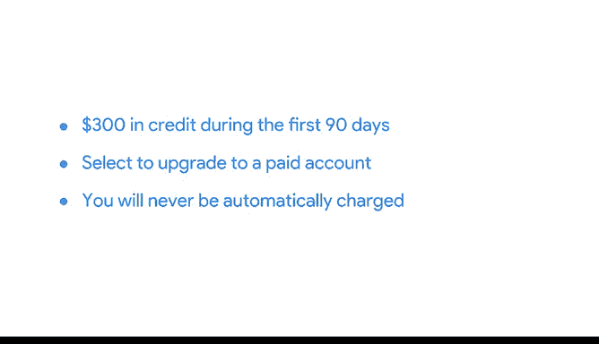

# 030：30_03_01_熟悉BigQuery_沙盒环境与计费选项.zh_en - GPT中英字幕课程资源 - BV19X4y1n7Xd

## 课程概述 📋

在本节课中，我们将要学习BigQuery提供的不同账户类型。我们将了解如何根据需求选择合适的账户，以及如何访问它们。理解这些选项对于有效且经济地使用BigQuery至关重要。

## 账户类型介绍

在本课程中，你已经看到BigQuery如何用于查看和分析来自海量源的数据。本节中，我们来探索BigQuery提供的不同账户选项。

BigQuery为你提供了免费使用的选项，同时也提供付费方案。不过，本课程的实践活动不需要付费选项。我们将讨论两种账户类型：沙盒账户和免费试用账户。

## 沙盒账户 🏖️

沙盒账户是免费提供的，任何拥有谷歌账户的人都可以登录并使用它。

以下是沙盒账户的一些限制：
*   你最多只能同时拥有 **12个项目**。这意味着如果你想创建第13个项目，就必须删除原有的12个项目中的一个。
*   它不允许你向数据库插入新记录或更新现有记录的字段值。这些数据操作语言（DML）操作在沙盒环境中不受支持。

然而，你在本课程的活动中不需要进行这些操作。你可以在BigQuery官方文档中阅读更多关于沙盒账户限制的信息。这是我们将在大多数活动中使用的账户类型。

## 免费试用账户 🆓

在介绍沙盒账户之前，我们应该谈谈另一种免费使用BigQuery的方式：谷歌云免费试用。

免费试用让你能够以更少的限制，访问BigQuery提供的更多功能。免费试用在头90天内为你提供**300美元的信用额度**，用于谷歌云服务。

如果你只是使用BigQuery控制台来练习SQL查询，你的花费将远低于这个额度。在你用完300美元信用额度或90天期限后，你的免费试用将到期。届时，你需要手动选择升级到付费账户，才能继续在谷歌云中工作。

## 计费与升级说明 💳

你的付款方式在免费试用结束后**不会**被自动扣费。免费试用确实要求你为谷歌云设置一个付款选项，但除非你选择升级账户，否则它不会向你收费。不过，它确实要求你输入一种付款方式。因此，如果你对这个选项感到不安，我们完全理解。

这也是BigQuery沙盒账户存在的原因之一，这样你就不必输入任何付款信息。

对于任何一种账户类型，你都可以随时升级到付费账户，并保留所有现有项目。如果你设置了免费试用账户，但在试用期结束时选择不升级到付费账户，你可以在那时设置一个免费的沙盒账户。

## 课程总结 🎯

本节课中，我们一起学习了BigQuery的两种主要免费访问方式：沙盒账户和免费试用账户。我们了解了沙盒账户的便利性及其限制，也探讨了免费试用账户提供的更多功能及其计费规则。理解这些选项将帮助你在学习和实践中，根据自身需求和舒适度，选择最合适的BigQuery使用方式。