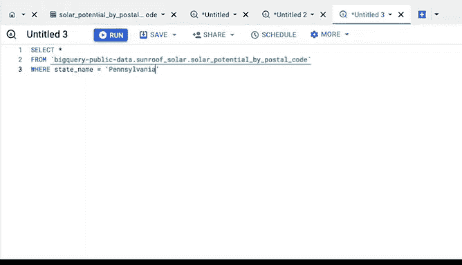

# 031：谷歌数据分析师第三课《为数据探索做准备》 📊


在本节课中，我们将学习如何通过排序、筛选以及编写SQL查询来为数据分析做准备，从而从海量数据中精准定位所需信息。

你已经了解到，在电子表格中对数据进行排序和筛选有助于数据分析师定制信息。定制数据能让其更具意义，也更容易理解、分析和可视化。

你还发现，有些电子表格可能极其冗长和复杂。因此，懂得如何聚焦于你所需的精确数据，同时暂时搁置其余部分，能帮助你专注于分析。

这一点对于数据库同样适用。有时数据量过大，无法下载或无法放入电子表格中。此时，数据分析师会使用SQL创建查询，以便从更大的数据集中查看他们想要的特定数据。

我们之前学过，数据库是存储在计算机系统中的数据集合，而SQL代表结构化查询语言。数据分析师使用查询语言与数据库进行通信。在更早的视频中，你也了解到关系型数据库包含一系列可以相互连接以形成关系的表。这些关系通过主键和外键来体现。

数据分析师通过编写查询语句来从这些表中获取数据。让我们看看这是如何运作的。

## 从数据浏览开始 🔍

我们将从浏览数据表开始。在这里，我们可以看到有哪些公共数据集可用。在使用数据之前，我们先滚动浏览一下，以了解其大致内容并确保数据是干净的。

有些数据表查看器允许你在编写查询之前预览几行数据。如果你想快速浏览以确保数据集适合你的项目，这会很有帮助。为了演示这一点，让我们查看一个示例数据集。这个数据集显示了一年中照射到屋顶的阳光量。😊

例如，这对于从事太阳能项目的数据分析师来说将非常有用。

我们首先预览数据。然后，我们将从这个数据中选择一个子集，其中包含地区、州、年日照量等信息。

## 编写查询查看完整数据 📝

要查看完整数据，让我们编写一个查询。第一步是找出数据集的完整正确名称。为此，选择“按邮政编码的太阳能潜力”数据，然后选择“查询表”。

数据集的名称显示在两个反引号内。这是为了帮助我们更轻松地阅读查询。在这种情况下，我们也可以去掉反引号，查询仍然可以运行。😊

点号前的单词代表数据库名称，点号后的单词代表表名称。

现在让我们选择并复制数据名称，因为我们马上会用到它。

接下来，点击加号以编写新查询。大多数查询以 **`SELECT`** 关键字开始。然后我们加一个空格。因为我们想查看整个数据集，我们会在后面加上一个星号 **`*`**。

星号表示我们希望包含所有列。这是一个很好的快捷方式，因为没有它，我们将不得不键入每个字段名称。接着，我们按回车键并键入 **`FROM`**。

**`FROM`** 的作用正如其名，它指示数据来自哪里。之后，我们再添加一个空格。现在，我们粘贴之前复制的数据名称。最后，运行查询。

现在，在开始处理数据之前，我们可以仔细检查数据。需要记住的一个重要点是，SQL查询可以用许多不同的方式编写，但仍能提供相同的结果。

例如，我们本可以将此查询写成一长行指令，像这样：
```sql
SELECT * FROM `bigquery-public-data.sunroof_solar.solar_potential_by_postal_code`;
```
我们仍然会得到相同的结果。额外的换行和空格不会影响查询结果，但它们能使你的查询更有条理，对你自己和他人来说都更易阅读。

## 筛选特定数据 🎯

现在，如果项目不需要所有这些字段，我们可以使用SQL来查看特定的一个或多个数据片段。为此，我们在查询中指定特定的列名。

例如，也许我们只想查看来自宾夕法尼亚州的数据。那么，我们可以像刚才学到的那样开始编写查询：**`SELECT`** [空格]，添加星号 **`*`**，然后 **`FROM`** 我们的太阳能潜力数据库。但这次我们要添加 **`WHERE`** 子句。

所以，添加一个空格和 **`state_name`**（列名）。现在，因为我们只想查看来自宾夕法尼亚州的数据，我们添加等号和用单引号括起来的单词“Pennsylvania”。在SQL中，单引号表示字符串的开始和结束。最后，重新运行查询。

现在，我们可以只查看宾夕法尼亚州的太阳能潜力数据了。我们已经得到了想要的数据，并准备好开始利用它，这将在后续课程中涉及。😊

## 本章回顾与总结 🎉

但现在，让我们庆祝完成了另一个模块。你已经涵盖了许多复杂且技术性很强的信息。不过，随着不断练习，一切都会开始感觉自然得多。现在，请花点时间坐下来，回想一下你所学到的一切。

你了解了元数据，以及它如何通过描述数据内容来保持数据的组织性。你看到了内部和外部数据如何被访问，以及数据分析师如何使用它们来找到有说服力的见解以解决业务问题。你可以对数据进行排序和筛选，以精确定位所需信息。最后，你刚刚学习了查询，甚至练习编写了一些。😊

接下来，你将有一些阅读材料，然后是一个每周挑战来测试你的知识。这将帮助你确认是否理解了我们在这些视频中所讲的内容。一如既往，如果你对某个问题不确定，我强烈建议你复习视频和阅读材料以找到答案。你现在是一名数据侦探了，请运用这些技能。

继续努力，我们每周挑战后再见。

---



