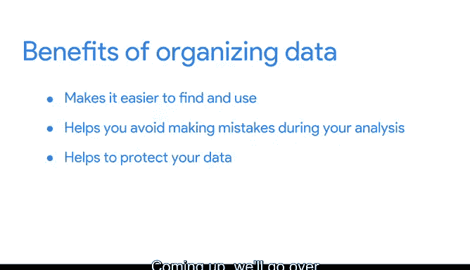

# 032：谷歌数据分析师第三课《为数据探索做准备》data-preparation 📊

## 课程概述

在本节课中，我们将学习如何为数据处理和分析做好准备。我们将重点探讨如何组织和保护数据，以确保分析过程的效率和安全性。

---

## 建立对数据的信心 🔒

欢迎回来。到目前为止，我们主要关注如何为数据处理和分析准备数据。在接下来的视频中，我们将探讨该过程的另一个重要部分：组织和保护数据。

保持数据井井有条有几个重要原因。它使数据更容易查找和使用，有助于避免在分析过程中出错，并有助于保护数据。

接下来，我们将介绍个人和专业用途的数据组织基础，以及文件命名规范。然后，我们将了解电子表格的一些安全功能。

---

## 学习目标与成果 🎯

在接下来的几个视频结束时，你将能够完成所有这些任务，并且能够向利益相关者解释这些步骤，让他们对你的数据实践感到安全可靠。

当你准备好开始时，请继续观看下一个视频。在那里，我们将从为个人用途组织数据开始。