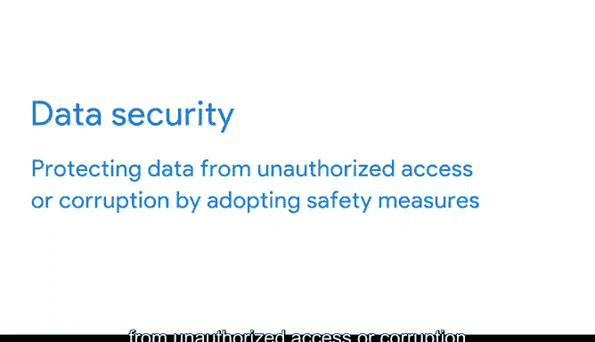
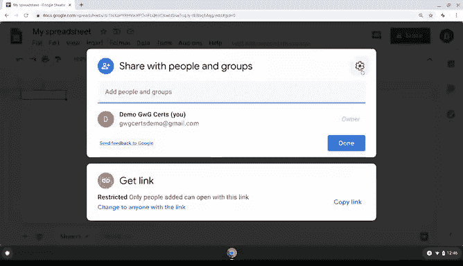
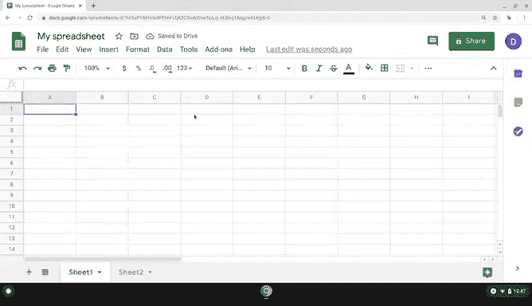

# 034：34_04_01_电子表格中的安全功能.zh_en 📊🔒

## 概述

在本节课中，我们将要学习如何保护电子表格中的数据。数据整理完毕后，确保其安全至关重要。电子表格软件内置了多种安全功能，可以帮助我们实现这一目标。

## 什么是数据安全？

上一节我们介绍了如何整理数据，本节中我们来看看如何保护数据。你可能会认为安全功能仅用于防止他人访问数据，但这只是其中一种。安全功能的设计可以阻止未经授权的用户查看特定文件，或者锁定工作表以防止你意外破坏公式。这被称为**数据安全**。

**数据安全**意味着通过采取安全措施，保护数据免受未经授权的访问或损坏。

## 常见电子表格程序的安全功能

无论你使用哪种电子表格程序，它们都内置了相似的安全措施。作为数据分析师，你会经常遇到 Google Sheets 和 Excel。接下来，我们谈谈它们的共同点。

以下是它们共有的核心安全功能：

*   **工作表与单元格保护**：两个程序都允许你保护整个工作表或其中的特定部分（如表中的单个单元格）不被编辑。这样，在与他人协作时，你可以轻松锁定公式，防止它们被意外破坏。
*   **访问控制**：谈到协作，Excel 和 Google Sheets 都具备访问控制功能，例如**密码保护**和**用户权限**。这让你能更好地控制谁可以对你的电子表格执行何种操作。

## 不同程序间的细微差别

由于这些程序位于不同的平台（本地与云端），其功能实现略有不同。

*   对于 **Excel** 电子表格，你可以在通过电子邮件发送给其他用户之前，使用密码对文件和工作表进行**加密**。
*   在 **Google Sheets** 中，这些设置位于“共享”菜单下，允许你控制谁可以在线查看或编辑表格。

## 其他实用安全措施

除了上述功能，还有一些其他实用的操作可以增强数据安全性。

以下是你可以采取的措施：

*   **复制工作表**：Google Sheets 可以复制，这样用户可以在不更改原始数据的情况下使用数据。
*   **隐藏与取消隐藏标签页**：在 Sheets 和 Excel 中，标签页可以被隐藏和取消隐藏，这允许你控制正在查看哪些数据。但请记住，隐藏的标签页也可能被他人取消隐藏，因此请确保你能够接受这些标签页仍然可以被访问。

作为数据分析师，数据安全将是优先事项。但无论你使用哪种程序创建电子表格，都有安全功能来帮助你确保工作的安全。

还有一些其他基本的、可以整体上使数据更安全的最佳实践，我们将在后续的阅读材料中介绍。

## 模块总结与后续安排

恭喜你完成本模块的学习！在这些视频中，我们涵盖了以下内容：

*   为个人和工作用途组织数据的策略。
*   如何制定实用的文件命名规范。
*   可以在电子表格中利用的一些安全措施。

在进入数据分析生命周期的下一步之前，确保你的数据已准备就绪非常重要，这包括组织数据并确保其安全。

和往常一样，本视频之后是你本周的挑战。我相信你能做到！

在每周挑战之后，有一些关于连接在线数据社区的选修材料。当你开始构建数据分析职业生涯时，与他人建立联系、了解该领域的新趋势并分享自己的工作将非常有价值。我认为你会从那些视频中收获很多，它们将帮助你建立专业的在线形象，并找到与你所在领域人士交流的方式。这在网络日益重要、远程工作机会成为常态的今天至关重要。

但如果你对自己的在线形象已经相当有信心，可以直接进入课程挑战。

祝你在本周的挑战中好运，我们很快再见。