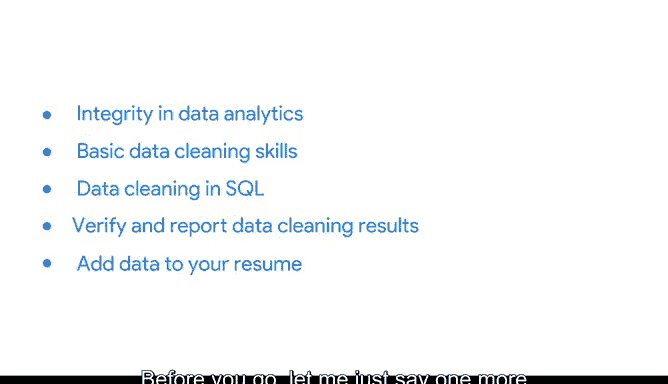

# 036：谷歌数据分析师课程第三课《为数据探索做准备》总结 🎉

在本节课中，我们将回顾《为数据探索做准备》课程的核心内容，并展望下一阶段的学习重点。

## 课程回顾 📚

上一节我们介绍了数据准备的关键步骤，本节中我们来总结已掌握的知识点。

截至目前，你已经学习了数据类型与数据结构，并认识到在数据准备与分析过程中，**偏见**与**可信度**的重要性。我们还探索了数据库、组织与保护数据的不同方法，甚至了解了如何加入数据分析社区。

以下是本课程涵盖的核心技能点：

*   理解数据**类型**（如整数、字符串）与**结构**（如表格、数据库）
*   识别数据中的**偏见**并评估其**可信度**
*   使用数据库有效**组织**数据
*   应用最佳实践**保护**数据安全
*   与数据分析社区建立联系

所有这些知识都将帮助你为数据分析生命周期中的下一步——**数据处理**——做好准备。

## 迈向下一步：数据处理 🚀

在开始分析数据之前，确保数据**干净**且**完整**是最后的关键步骤，而这正是下一门课程的核心内容。

我很高兴地向你重新介绍谷歌同事萨莉，她将在接下来的课程中担任你的向导。这门课程将专注于为分析而进行的**数据清洗与处理**。

以下是你在下一课程中将学习的主要内容：

*   **数据分析中的完整性**：理解数据质量的核心原则。
*   **基础数据清洗技能**：掌握清理数据集的实用技巧。
*   **SQL 中的数据清洗**：学习使用 `SQL` 语言高效清洗数据。
*   **验证与报告清洗结果**：学会如何核查并记录数据清洗过程。
*   **丰富你的简历**：如果你准备好了，可以将这些新技能添加到你的简历中。

## 总结与鼓励 👏

本节课中，我们一起学习了数据准备的基础，包括理解数据结构、重视数据伦理与安全，并为接下来的数据清洗阶段打下了坚实基础。

在你离开前，请允许我再次说一句：做得非常出色！当你准备好时，可以随时开始下一门课程，萨莉将在那里指导你完成学习。

**祝你学习顺利！**