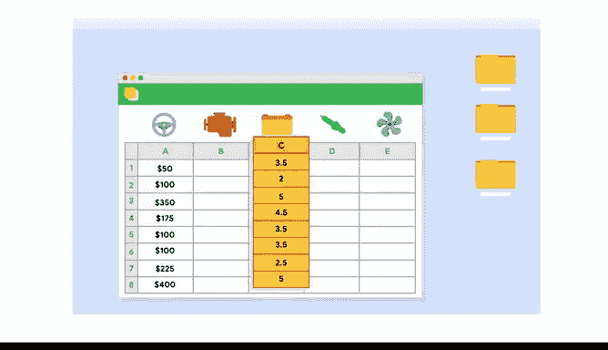

# 003：从脏数据到干净数据的处理 - 03_01_03 平衡目标与数据完整性 📊

在本节课中，我们将学习如何在数据分析过程中平衡业务目标与数据完整性。我们将探讨如何识别数据局限性，并学习在数据不完整或不准确时，如何调整分析方法以达成业务目标。

---

上一节我们介绍了数据完整性的基本概念，本节中我们来看看如何在实际分析中平衡业务目标与数据完整性。

记住检查数据完整性很重要。同样重要的是，确保你使用的数据与业务目标保持一致。这为数据完整性的维护增加了另一层考量，因为你使用的数据可能存在需要处理的局限性。将数据与业务目标匹配的过程实际上可以相当直接。

以下是一个快速示例。假设你是一家生产和销售汽车零部件企业的分析师。如果你需要回答关于某个零件销售产生的收入问题，那么你会从数据中提取收入表。如果问题是关于客户评价，那么你会提取评价表来分析平均评分。但在深入任何分析之前，你需要考虑一些可能影响分析的局限性。

如果数据没有被妥善清理，那么你还无法使用它。你需要等待彻底的数据清理完成。

现在，假设你试图找出平均客户的消费金额，并且你注意到同一客户的数据出现在多行中。这被称为重复数据。为了解决这个问题，你可能需要更改数据的格式，或者可能需要改变计算平均值的方式。否则，数据看起来就像是属于两个不同的人，你将得到误导性的计算结果。

你可能还会意识到没有足够的数据来完成准确的分析。也许你只有几个月的销售数据。你有可能等待更多数据，但更可能的情况是，你必须在仍能满足目标的同时，改变你的流程或寻找替代数据源。

我喜欢把数据集想象成一幅画。看看这张图。我们看到的是什么？除非你是旅行专家或了解该地区，否则仅凭这两张图像可能很难辨认。从视觉上看，当我们看不到全貌时，情况非常明显。当你看到完整的画面时，你会意识到你在伦敦。数据不完整时，很难看清全貌，无法真正了解正在发生的事情。

我们有时会信任数据，因为如果它以行和列的形式呈现给我们，似乎我们只需要查询就能得到所需的一切。但这并不正确。我记得有一次，我发现数据不足，不得不寻找解决方案。我曾为一家在线零售公司工作，被要求找出缩短客户从购买到收货时间的方法。更快的交货时间通常会带来更满意的客户。当我检查数据集时，我发现跟踪信息非常有限。我们缺少一些关键细节，因此数据工程师和我创建了新的流程来跟踪额外信息，例如旅程中的停靠点数量。利用这些数据，我们缩短了从购买到交付的时间，并看到了客户满意度的提升。这感觉非常棒。

学会在处理数据问题的同时保持对目标的专注，将帮助你在数据分析师的职业生涯中取得成功。你的成功之路仍在继续。接下来，你将学习更多关于使数据与目标保持一致的知识。继续努力。