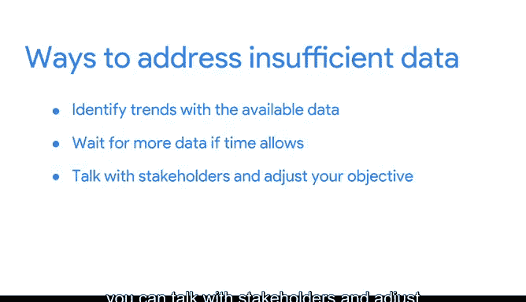

# 004：处理数据不足 📊

在本节课中，我们将要学习当数据不足以支持业务目标时，数据分析师可以采取的策略。我们将探讨如何设定分析范围、确定应包含的数据，并学习应对不同类型数据不足情况的方法。

每位分析师都曾遇到过数据不足以帮助实现业务目标的情况。尽管每天都会产生大量数据，但数据不足的情况确实存在。因此，我们需要讨论当数据不足时可以采取的措施。

上一节我们介绍了数据不足的普遍性，本节中我们来看看如何为分析设定界限以及应包含哪些数据。

我曾在一家支持中心担任数据分析师。我们每天都会收到客户问题，这些问题被记录为支持工单。我的任务是预测每月收到的支持工单数量，以确定需要额外招聘多少员工。拥有至少跨越数年的充足数据至关重要，因为我必须考虑年度变化和季节性变化。如果只有当年的数据可用，我就不会知道一月份的激增是常见现象，并且与人们在假期后要求退款有关。由于数据充足，我能够建议在一月份招聘更多员工以作准备。

挑战总会出现。但好消息是，一旦明确了业务目标，你就能判断数据是否充足。如果数据不足，你可以在开始分析之前处理这个问题。

现在，让我们来看看你可能会遇到的一些限制，以及如何处理不同类型的数据不足情况。

以下是几种常见的数据不足情况及应对方法：

*   **数据来源单一**：假设你在旅游业工作，需要找出最常被搜索的旅行计划。如果只使用一个预订网站的数据，你就将自己限制在单一来源的数据中。其他预订网站可能显示出不同的趋势，这些趋势在你的分析中可能需要考虑。如果此类限制影响了你的分析，你可以暂停并返回与利益相关者商讨计划。
*   **数据持续更新**：如果你的数据集不断更新，意味着数据仍在流入，可能不完整。例如，如果你正在分析一个全新旅游景点的兴趣度和客流量，可能没有足够的数据来确定趋势。你可以等待一个月来收集数据，或者与利益相关者沟通，询问是否可以调整目标。例如，你可以分析周与周之间的趋势，而不是月与月之间的趋势。你也可以基于过去三个月的趋势进行分析，并预测第四个月的客流量可能如何。你可能没有足够的数据来判断这个数字是过高还是过低，但你可以告诉利益相关者，这是基于当前数据的最佳估计。
*   **数据过时**：另一方面，你的数据可能过于陈旧，不再具有相关性。关于客户满意度的过时数据不会包含最新的反馈，因此你依赖的酒店或度假租赁评分可能不再准确。在这种情况下，最好的办法可能是寻找一个新的数据集来处理。
*   **地理范围有限**：地理范围有限的数据也可能不可靠。如果你的公司是全球性的，你不会希望使用仅限于一个国家旅行数据的数据集，你会需要一个包含所有国家的数据集。

以上只是你将遇到的一些最常见限制，以及一些应对方法。你可以利用现有数据识别趋势，如果时间允许，可以等待更多数据。你可以与利益相关者沟通并调整目标，或者寻找新的数据集。

采取这些步骤的必要性取决于你在公司中的角色，也可能取决于更广泛行业的需求。但学会如何处理数据不足，始终是为成功做好准备的好方法。

你的数据分析能力正在不断增强，而且时机正好。在学习了更多关于限制和解决方案的知识后，你将学习到统计功效——另一个可供你使用的强大工具。

本节课中我们一起学习了当面临数据不足时，如何通过设定分析范围、与利益相关者沟通、调整目标或寻找新数据源等策略来应对挑战，为后续的分析工作奠定坚实基础。