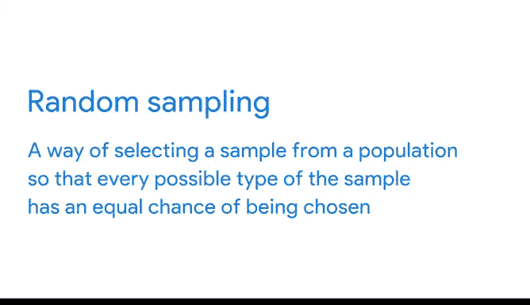

# 005：谷歌数据分析师第四课《从脏数据到干净数据的处理》- 05_01_03 样本量的重要性 📊

在本节课中，我们将要学习样本量在数据分析中的重要性。我们将探讨什么是总体和样本，为什么有时需要使用样本而非总体，以及如何通过随机抽样来确保样本的代表性。

---

上一节我们讨论了为满足业务目标需要获取正确类型的数据。本节中，我们来看看确保分析尽可能准确所需的**数据量**的重要性。

数据分析师所说的**总体**，指的是某个特定数据集中所有可能的数据值。如果你能在分析中使用总体的100%，那当然很好。

但有时，收集整个总体的信息并不可行。这可能因为过程太耗时或成本太高。

例如，假设一家全球组织想更多地了解养猫的宠物主人。你的任务是找出加拿大的猫主人更喜欢哪种玩具。但加拿大有数百万猫主人，从所有人那里获取数据将是一个巨大的挑战。

别担心，让我为你介绍**样本量**。

当你使用**样本量**或**样本**时，你使用的是总体中具有代表性的一部分。其目标是从总体中的一个小群体获取足够的信息，以便对整个总体进行预测或得出结论。

**样本量有助于确保你对“结论能准确代表总体”这一点的置信程度。**

因此，对于猫主人的数据，一个样本量可能包含数百或数千人的数据，而不是数百万。使用样本进行分析更具成本效益，也更省时。

如果操作仔细且考虑周全，使用样本量可以得到与追踪每一位猫主人来找出他们最喜欢的猫玩具相同的结果。

然而，这也有一个潜在的缺点：当你只使用总体的一小部分样本时，可能会导致不确定性。你无法100%确定你的统计数据是完整且准确地代表了总体。

这导致了**抽样偏差**，我们在课程前面已经介绍过。抽样偏差是指样本不能代表整个总体的情况。这意味着总体中的某些成员被过度代表或代表不足。

例如，如果用于从猫主人那里收集数据的调查只包括拥有智能手机的人，那么没有智能手机的猫主人就不会在数据中得到体现。

使用**随机抽样**可以帮助解决一些抽样偏差问题。

**随机抽样**是从总体中选择样本的一种方式，它确保样本的每一种可能类型都有被选中的平等机会。

再次回到我们的猫主人例子。使用猫主人的随机样本意味着，每种类型的猫主人都有平等的机会被选中。因此，住在安大略省公寓的猫主人与住在阿尔伯塔省房屋的猫主人有相同的被代表机会。

作为数据分析师，你会发现创建样本量通常在你接触数据之前就已经发生了。但了解你将要分析的数据能代表总体并符合你的目标，对你来说仍然很重要。

了解你在数据旅程中即将面对什么也是有益的。

在下一个视频中，你将有机会更深入地熟悉样本量。我们那里见。😊

---

**本节课总结：**
本节课我们一起学习了总体与样本的概念。我们了解到，由于成本或时间的限制，分析整个总体通常不现实，因此需要使用具有代表性的样本。样本量的大小影响分析的准确性，而**随机抽样**是确保样本代表性、减少**抽样偏差**的关键方法。记住，一个精心挑选的样本可以高效地帮助我们得出关于总体的可靠结论。