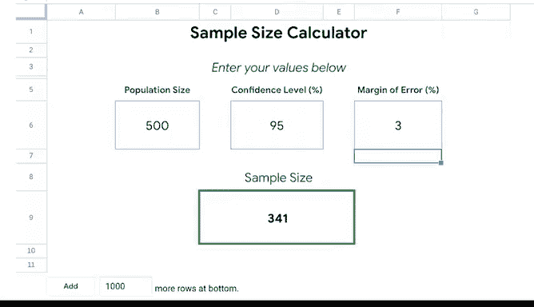

# 007：确定最佳样本量 📊

在本节课中，我们将深入探讨样本量及其与数据完整性的关系。我们将学习如何确定一个合适的样本量，以确保从样本中得出的结论能够有效代表整个总体。

---

上一节我们介绍了样本的基本概念，本节中我们来看看如何科学地确定样本量。

许多组织会采用类似商店发放试用品的方式来了解其产品或服务。他们从更大的总体中抽取一部分作为样本，并对其进行测试，以推断总体的特征。虽然其中涉及复杂的统计计算，但我们将重点关注这个过程的核心概念和步骤。

样本量是指从总体中抽取的、能够代表总体的那部分数据量。对于企业而言，这是一个非常重要的工具。分析整个总体的数据可能既昂贵又耗时，因此使用合适的样本量通常是最合理的选择，并且仍能得出有效且有用的结论。

网上有许多便捷的计算器可以帮助你确定样本量。使用这些计算器时，你需要输入三个关键参数：**置信水平**、**总体大小**和**边际误差**。我们已经讨论过总体大小，接下来我们将学习另外两个概念。

了解这些概念将帮助你理解为什么计算样本量需要它们。

**置信水平**是指你的样本准确反映更大总体的概率。你可以将其理解为对某件事或某个人的信心程度。99%的置信水平是理想的，但大多数行业希望至少达到90%或95%的置信水平。例如，制药行业在使用样本进行测试时，通常希望置信水平尽可能高，因为他们测试的是药品，需要确保其对所有人都有效且安全。而对于其他研究，组织可能只需要知道测试或调查结果指引的方向是正确的即可，例如油漆公司测试新颜色时，较低的置信水平也是可以接受的。

**边际误差**则告诉你，样本量结果与你使用样本所代表的整个总体所得结果之间的接近程度。简单来说，它衡量了样本估计值与真实总体值之间可能存在的最大差异。

让我们通过一个例子来理解如何应用这些概念。假设一所中学的校长请你进行一项关于学生糖果偏好的研究。学校有500名学生，他们要求置信水平为95%，边际误差为5%。

以下是确定样本量的步骤：

1.  打开一个在线样本量计算器或使用电子表格中的公式。
2.  在相应字段中输入总体大小（500）、置信水平（95%）和边际误差（5%）。
3.  计算器会给出结果，在本例中约为218。

这意味着，对于这项研究，合适的样本量是218名学生。如果我们调查了218名学生，发现其中55%的人更喜欢巧克力，那么我们就有相当高的信心认为，这一比例也适用于全部500名学生。218这个数字是基于我们95%的置信水平和5%的边际误差标准所需调查的最低人数。

需要注意的是，置信水平和边际误差**并不需要相加等于100%**，它们是相互独立的两个指标。如果我们改变边际误差，例如从5%降低到更严格的3%，那么所需的样本量就会变大，从大约218增加到341，以使研究结果更能代表总体。

---

本节课中我们一起学习了确定最佳样本量的核心概念。我们了解到，通过设定**置信水平**和**边际误差**，并利用在线计算工具，可以科学地计算出能够代表总体的最小样本量。掌握这一技能将帮助你在处理数据时，更高效、更可靠地通过样本洞察总体特征。

在接下来的课程中，我们将更详细地探讨边际误差等概念。下次见。