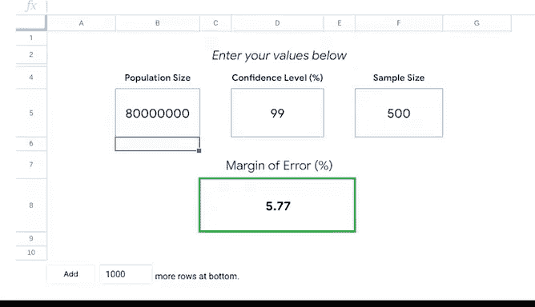

# 008：从脏数据到干净数据的处理 🧹


## 第八课：评估数据可靠性 📊

在本节课中，我们将学习**误差范围**的概念及其计算方法。理解误差范围对于评估数据可靠性至关重要，它能帮助我们判断样本结果与总体结果之间的差异程度。

---

### 误差范围的定义

上一节我们简要提到了误差范围，但未完全解释。本节中，我们将详细说明误差范围及其计算方法。

误差范围是指**样本结果与总体实际结果之间可能存在的最大差异**。在实际数据分析中，我们通常无法调查整个总体，因此需要从总体中抽取样本。基于样本大小，误差范围能告诉我们样本结果与总体结果之间可能存在的差异程度。

误差范围有助于评估假设检验数据的可靠性。误差范围越接近零，样本结果与总体结果的一致性越高。

---

### 误差范围的示例

以下是误差范围的一个具体示例：

假设你完成了一项全国性调查，样本为总体的一部分。你询问每周工作五天的人是否喜欢四天工作周的想法。调查结果显示，60%的人偏好四天工作周，误差范围为10%。

这意味着，如果我们调查全国所有每周工作五天的人，同意该想法的人数比例将在50%到70%之间。这是因为误差范围从调查结果的60%向两个方向计算。

如果你为调查设定了95%的置信水平，那么总体回答“是，他们想要四天工作周”的比例有95%的可能性落在50%到70%之间。由于误差范围与50%标记重叠，你不能确定公众喜欢四天工作周的想法。在这种情况下，你必须说调查结果不确定。

---

### 如何降低误差范围

如果你想降低误差范围，例如降至5%，使范围在55%到65%之间，可以增加样本大小。但如果你已经知道样本大小，可以自行计算误差范围，从而基于误差范围判断结果具有统计显著性的可能性。

一般来说，调查中包含的人越多，样本越能代表总体。降低置信水平也会产生相同效果，但这也会降低调查的准确性。

---

### 计算误差范围的要素

要计算误差范围，你需要以下三个要素：

- **总体大小**
- **样本大小**
- **置信水平**

与样本大小计算类似，你可以在网上搜索“误差范围计算器”找到许多工具。但我们将在电子表格中演示计算方法，就像我们计算样本大小时所做的那样。

---

### 误差范围计算示例

假设你正在进行一项关于新药有效性的研究。样本大小为500名参与者，该疾病影响全球1%的人口，即约8000万人，这是你研究的总体。由于是药物研究，你需要99%的置信水平，并且需要较低的误差范围。我们来计算一下。

我们将总体大小、置信水平和样本大小的数字放入电子表格的相应单元格中。结果显示，误差范围约为±6%。

```plaintext
误差范围 = ±6%
```

当药物研究完成时，你将误差范围应用于结果，以确定结果的可靠性。



---

### 工具与总结

电子表格中的此类计算器只是确保数据完整性的众多工具之一。记住，检查数据完整性并使数据与目标保持一致，将有助于你顺利完成分析。

了解样本大小、统计功效、误差范围以及我们涵盖的其他主题，将使你的分析更加顺利。

本节课中，我们一起学习了误差范围的定义、示例、计算方法及其在评估数据可靠性中的重要性。这些概念是数据分析的基础，掌握它们将帮助你在实际工作中做出更准确的判断。

---

接下来，我们将深入探讨干净数据的方方面面。数据冒险仍在继续，很高兴你能一路同行。加油！😊