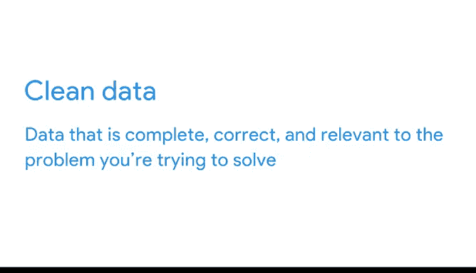

# 009：谷歌数据分析师第四课《从脏数据到干净数据的处理》 🧹

在本节课中，我们将学习如何识别和处理脏数据，理解数据清理的重要性，并掌握确保数据完整性的基本方法。

---

## 概述：脏数据的代价与成因

你能猜到不准确或糟糕的数据每年给企业造成多少损失吗？损失可能是数千美元、数百万美元，甚至数十亿美元。根据IBM的数据，仅在美国，低质量数据造成的年成本就高达**3.1万亿美元**。这是一个巨大的数字。

现在，你能猜到导致数据质量低下的首要原因是什么吗？它不是新系统的实施，也不是计算机技术故障。最常见的因素实际上是**人为错误**。

这里有一张来自律师事务所的电子表格，它向客户展示了他们购买的法律服务、服务订单号、支付金额以及支付方式。

脏数据可能源于多种情况：某人错误地输入了数据、格式不一致、字段留空，或者同一数据被重复输入导致重复记录。

**脏数据**是指不完整、不正确或与你试图解决的问题无关的数据。当你使用脏数据时，你无法确保结果的正确性。事实上，你几乎可以断定结果不会正确。

---

## 清洁数据与数据完整性

之前我们了解到，**数据完整性**对于可靠的数据分析结果至关重要。而清洁数据有助于实现数据完整性。

**清洁数据**是指完整、正确且与你试图解决的问题相关的数据。

当你使用清洁数据时，你会发现项目进展会更加顺利。

我记得第一次亲眼目睹清洁数据有多么重要。那时我刚接触SQL，觉得它像魔法一样神奇。我可以让计算机汇总数百万个数字，节省大量的时间和精力。但我很快发现，这只有在数据清洁时才有效。

如果在一个本应只有数字的列中，哪怕出现一个意外的字母，计算机就不知道该如何处理，会抛出一个错误。突然间我就卡住了，而我绝不可能靠自己手动去加总那数百万个数字。因此，我必须清理那些数据才能使其正常工作。

好消息是，有许多有效的流程和工具可以帮助你完成这项工作。

接下来，你将获得必要的技能和知识，以确保你处理的数据始终是清洁的。在此过程中，我们将更深入地探讨清洁数据与脏数据的区别，以及为什么清洁数据如此重要。我们还将讨论清理数据的不同方法，以及在此过程中需要留意的常见问题。

准备好开始了吗？我们开始吧。

---

## 清洁数据的重要性

上一节我们介绍了脏数据的巨大成本和人为错误的主要成因。本节中，我们来看看清洁数据为何是成功分析的基础。

使用清洁数据，你的分析项目将运行得更顺畅，结果也更可靠。反之，脏数据会导致错误、延误，并最终影响决策质量。

---

## 数据清理的方法与常见问题

理解了清洁数据的重要性后，我们来看看如何进行数据清理。数据清理是一个系统化的过程，旨在识别并纠正数据集中的错误、不一致和不相关之处。

以下是数据清理过程中常见的几种问题及其处理方法：

1.  **处理不完整数据**：例如字段留空。解决方法可能包括删除空行、使用统计方法（如均值、中位数）填充，或根据业务逻辑进行推断填充。
    *   **代码示例（Python Pandas）**：`df.fillna(df[‘column_name’].mean(), inplace=True)`

2.  **纠正不正确数据**：例如拼写错误、格式错误或超出合理范围的值（如年龄为200岁）。这通常需要结合验证规则和业务知识进行修正。
    *   **公式示例（数据验证）**：在电子表格中设置数据验证规则，确保输入值在特定范围内。

3.  **删除重复数据**：同一记录被多次输入。需要识别并移除这些重复项，保留唯一记录。
    *   **代码示例（SQL）**：`DELETE FROM table_name WHERE row_id NOT IN (SELECT MIN(row_id) FROM table_name GROUP BY duplicate_column);`

4.  **统一不一致的格式**：确保同一类数据（如日期、电话号码）在整个数据集中格式一致。例如，将“2023-01-01”、“01/01/2023”统一为一种格式。

在清理过程中，保持对原始数据的备份至关重要，并且所有清理步骤都应被记录，以确保过程的可追溯性和可重复性。

---

## 总结

本节课中，我们一起学习了数据清理的核心概念。我们了解到脏数据每年给企业造成巨大损失，而其首要成因是人为错误。我们明确了**脏数据**（不完整、不正确、不相关）和**清洁数据**（完整、正确、相关）的定义，并认识到清洁数据对于保障**数据完整性**和获得可靠分析结果至关重要。

最后，我们探讨了数据清理的常见方法，包括处理不完整数据、纠正错误值、删除重复项以及统一数据格式。掌握这些技能，是成为一名合格数据分析师的关键一步。