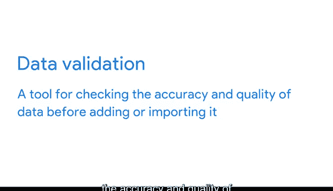

# 012：识别并修复脏数据 🧹

在本节课中，我们将学习数据分析中一个至关重要的环节：识别并修复脏数据。脏数据会严重影响分析的准确性和可靠性，因此掌握其常见类型和处理方法是数据分析师的核心技能。

我们将通过一个律师事务所的电子表格案例，逐一探讨脏数据的各种表现形式，并了解相应的清理策略。

## 脏数据的常见类型

上一节我们概述了脏数据的概念，本节中我们来看看几种具体的脏数据问题。以下是数据分析中常见的脏数据问题：

*   **拼写与文本错误**：包括拼写错误、字母顺序混乱、标点符号不一致以及一般的打字错误。
*   **不一致的标签**：数据标签不准确或不统一。
*   **格式与字段长度不一致**：例如，货币数据被错误地显示为百分比。
*   **缺失数据**：字段为空，也称为**空值（null）**。
*   **重复数据**：相同的数据被多次录入。

## 深入解析各类脏数据

### 拼写与文本错误

这类错误通常由人工录入数据时产生。例如，在输入客户姓名或产品名称时可能出现拼写错误。此外，数据集中还可能混用不同的货币单位（如美元和欧元），这同样需要被识别和统一。

清理这类错误通常依赖于组织制定的**数据完整性规则**，例如统一的拼写和标点规范。一个饮料公司可能规定所有员工在数据库中录入体积时使用“液量盎司”而非“杯”。虽然规则能极大减少数据清理的工作量，但无法完全杜绝人为错误。

### 不一致的格式

格式不一致是另一种常见问题。在我们的案例中，本应格式化为货币的数据被错误地显示为百分比。在修复此错误之前，律师事务所无法准确知道客户支付的服务费用金额。

### 缺失数据（空值）

空值（null）指的是空字段。处理这类脏数据比修正拼写或格式需要更多步骤。例如，数据分析师可能需要去查找“2020年7月4日”究竟是哪位客户进行了咨询，在找到正确信息后，再将其补充到电子表格中。

### 重复数据

重复数据可能由多人重复录入同一条记录，或操作者无意中复制粘贴导致。数据分析师的任务就是识别此类错误，并通过删除多余的副本来进行修正。

## 其他类型的脏数据问题

除了上述常见类型，我们还需要关注以下两类问题。

### 不一致的标签

为了理解标签问题，可以想象训练计算机从各种动物图片中识别熊猫。你需要给计算机展示成千上万张标有“熊猫”标签的图片。任何一张标签错误的图片（例如，一张熊的图片被误标为“熊猫”）都会导致模型学习出错。

### 不一致的字段长度

字段是电子表格中一行或一列中的单个信息单元。**字段长度**决定了该字段可以输入多少个字符。为电子表格中的字段指定长度是避免错误的有效方法。例如，“出生年份”列的字段长度应设为4，因为所有年份都是4位数。

一些电子表格应用程序提供了简单的方法来指定字段长度，确保用户只能在字段中输入特定数量的字符。这属于**数据验证**的范畴。

**数据验证**是在添加或导入数据之前，检查其准确性和质量的一种工具。它是**数据清洗**的一种形式。

## 总结

本节课中，我们一起学习了脏数据的多种类型，包括拼写错误、格式不一致、缺失值、重复数据、标签错误以及字段长度问题。理解这些问题是进行有效数据清洗的第一步。数据验证作为数据清洗的重要工具，能帮助我们在数据进入分析流程前就确保其质量。在接下来的课程中，我们将深入探讨更多具体的数据清洗技术和策略。掌握这些技能，对于成为一名优秀的数据分析师至关重要。