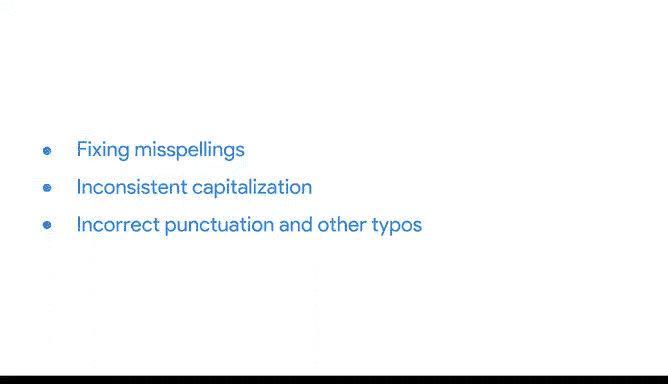

# 013：13_02_01_数据清洗工具与技术.zh_en - GPT中英字幕课程资源 - BV19m4y1J7dG

## 课程概述 📋

在本节课中，我们将要学习数据清洗的核心工具与技术。你已经了解了常见的脏数据类型，现在我们将探讨如何利用电子表格中的各种工具来清理数据，以确保数据的完整性，从而支持可靠的解决方案和决策。

数据清洗的具体技术会因数据集而异，因此我们无法涵盖所有可能遇到的情况。但本节内容将为你提供一个坚实的起点，帮助你处理数据分析师最常遇到的脏数据问题。你可以将接下来的内容视为数据清洗工具的“预告片”。

## 数据清洗的初步准备 🔧

在开始移除不需要的数据之前，一个好的做法是**先复制一份原始数据集**。这样，如果你不小心移除了未来可能需要的数据，可以轻松地找回并恢复。

完成备份后，你就可以着手处理重复数据或与当前问题无关的数据了。

## 处理重复数据 🔄

重复数据通常出现在合并多个来源的数据集，或使用同一公司内不同部门的数据时。对于数据分析师来说，重复数据可能带来大问题，因此在开始任何分析之前，找到并移除它们至关重要。

以下是一个例子：假设一个专业物流协会的会员数据库中，某位会员的500美元会费被重复记录。当汇总数据时，分析师会误认为该会员支付了1000美元，并基于这个错误数据做出决策，而实际上该会员只支付了500美元。

虽然可以手动修复这些问题，但大多数电子表格应用都提供了丰富的工具来帮助你**查找和移除重复项**。

## 移除无关数据 🗑️

无关数据是指不符合你试图解决的具体问题的数据，同样需要被移除。

回到协会会员列表的例子，如果数据分析师正在进行的项目只关注当前会员，那么他们就不应包含已退会或从未加入的人员信息。

移除无关数据需要更多时间和精力，因为你必须区分所需数据和不需要的数据。但请相信，做出这些决定将为后续工作节省大量精力。

## 清理多余空格与空白单元格 ⬜

多余的空格在你对数据进行排序、筛选或搜索时，可能导致意想不到的结果。由于这些字符很容易被忽略，它们会带来令人困惑的意外情况。

例如，如果一个会员ID号中包含多余空格，当你将该列从低到高排序时，这一行数据就会出现在错误的位置。

要移除这些不需要的空格或空白单元格，你可以手动删除，或者再次依赖电子表格提供的众多优秀函数来自动完成。

## 修正拼写与格式错误 ✏️

下一步数据清洗涉及修正拼写错误、不一致的大小写、错误的标点符号以及其他打字错误。

这类错误可能导致严重问题。假设你有一个用于联系客户的电子邮件数据库。如果某些邮件地址存在拼写错误、句点位置错误或其他任何打字错误，你不仅可能将邮件发送给错误的人，还有可能向无关人员发送垃圾邮件。

再以协会会员为例，拼写错误可能导致数据分析师在按会员类型排序并统计行数时，错误地计算专业会员的数量。

与之前遇到的问题一样，你可以手动修正这些问题，也可以利用电子表格工具，如**拼写检查、自动更正和条件格式**来简化工作。

此外，还有简单的方法可以将文本转换为**小写、大写或首字母大写**，我们稍后会再次查看这些功能。

## 统一数据格式 🎨

下一步是移除不一致的格式。当你从多个不同来源获取数据时，这一点尤其重要。每个数据库都有自己的格式，这可能导致数据看起来不一致。

为你的电子表格创建干净、一致的视觉外观，将有助于使其成为你和团队做出关键决策时的宝贵工具。

大多数电子表格应用也提供**“清除格式”工具**，这是一个节省时间的好帮手。

## 课程总结 📝

本节课中，我们一起学习了数据清洗是提高数据质量的关键步骤。你现在了解了许多不同的数据清洗方法，包括处理重复数据、移除无关信息、清理空格、修正错误以及统一格式。

在下一个视频中，你将进一步运用这些知识，学习如何清理来自多个数据源的数据。