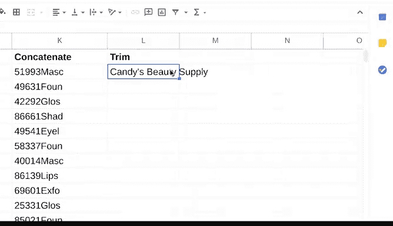

# 016：谷歌数据分析师课程第四课《从脏数据到干净数据的处理》 🧹

## 课程概述

在本节课中，我们将学习如何利用电子表格中的函数来优化数据清洗流程，确保数据的完整性。我们将介绍一系列实用的函数，帮助你高效地识别和修正数据中的常见问题。

---

## 优化数据清洗流程

上一节我们介绍了电子表格内置的一些数据清洗工具。本节中，我们将探索如何使用函数来优化你的工作，以确保数据的完整性。

函数是一组指令，用于对电子表格中的数据执行特定计算。

### 使用 `COUNTIF` 函数检查异常值

我们将讨论的第一个函数是 `COUNTIF`。`COUNTIF` 函数用于返回与指定值匹配的单元格数量。本质上，它计算某个值在一系列单元格中出现的次数。

让我们回到专业协会的电子表格示例。在这个例子中，我们希望确保协会的会员费被准确列出。我们将使用 `COUNTIF` 来检查一些常见问题，例如负数或远低于/高于预期的值。

以下是使用 `COUNTIF` 的步骤：

1.  首先，找到最便宜的会员费。学生会员是100美元，这将是该列中存在的最低数字。如果任何单元格的值小于100，`COUNTIF` 会提醒我们。
2.  在电子表格底部添加几行。然后在H列下方输入“会员费小于100”。
3.  在旁边的单元格中输入函数。每个函数都有特定的语法，必须遵循才能正常工作。语法是一种预定义的结构，包含所有必需的信息及其正确位置。
4.  `COUNTIF` 函数的语法如下：`=COUNTIF(范围, “指定值”)`。
5.  因此，函数将显示为：`=COUNTIF(I2:I72, “<100”)`。其中 `I2:I72` 是范围，值是“小于100”。
6.  这告诉函数遍历I列，并返回所有包含小于100的数字的单元格的计数。

结果显示有一个。滚动查看数据，我们发现有一条数据被错误地输入为负数。现在让我们修复它。

接下来，我们将使用 `COUNTIF` 搜索任何高于预期的值。最贵的会员类型是公司会员的500美元。在单元格中输入函数。这次它将显示为：`=COUNTIF(I2:I72, “>500”)`。`I2:I72` 仍然是范围，但值是“大于500”。这里也有一个，检查一下。这个条目多了一个零，应该是100美元。

### 使用 `LEN` 函数验证文本长度

我们将讨论的下一个函数是 `LEN`。`LEN` 函数通过计算文本字符串包含的字符数来告诉你其长度。这在清洗数据时很有用，特别是当你知道电子表格中的某些信息必须包含特定长度时。

例如，该协会使用六位数的会员识别码。因此，如果我们刚导入这些数据，并想确保我们的代码都是正确的位数，我们会使用 `LEN`。

`LEN` 的语法是：`=LEN(范围)`。

因此，我们将在“会员ID”列后插入一个新列。然后输入等号，接着输入 `LEN(`。范围是A2中的第一个会员ID号。通过闭合括号来完成函数。它告诉我们A2单元格中有六个字符。

让我们在整个列中继续这个函数，并找出是否有任何结果不是6。但与其手动浏览电子表格来搜索这些情况，我们将使用条件格式。我们之前讨论过条件格式，它是一个电子表格工具，当值满足特定条件时，会改变单元格的外观。现在让我们实践一下。

1.  选择B列的所有单元格（标题除外）。
2.  然后转到“格式”，选择“条件格式”。
3.  格式规则是：如果单元格不等于6，则格式化单元格。点击“完成”。
4.  包含7的单元格被高亮显示。

### 使用 `LEFT` 和 `RIGHT` 函数提取子字符串

现在，我们将讨论 `LEFT` 和 `RIGHT`。

*   `LEFT` 是一个函数，从文本字符串的左侧给你指定数量的字符。
*   `RIGHT` 是一个函数，从文本字符串的右侧给你指定数量的字符。

快速提醒一下，文本字符串是单元格内的一组字符，通常由字母、数字或两者组成。为了看到这些函数的实际应用，让我们回到之前化妆品制造商的电子表格。

这个电子表格包含产品代码。每个代码都有一个五位数的数字代码和一个四字符的文本标识符。但假设我们只想处理其中一侧。你可以使用 `LEFT` 或 `RIGHT` 来获取你需要的特定字符或数字集。

我们将首先使用 `LEFT` 函数来练习清理数据。`LEFT` 的语法是：`=LEFT(范围, 从文本字符串左侧开始所需的字符数)`。

这里，我们的项目只需要五位数的数字代码。因此，在一个单独的列中，输入 `=LEFT(`。然后添加范围，我们的范围是A2。然后输入逗号和数字5（对应我们的五位数产品代码）。最后，用闭合括号完成函数。我们的函数应该显示为：`=LEFT(A2, 5)`。按回车键，现在我们有了一个子字符串，即仅产品代码的数字部分。点击并拖动此函数到整个列，以仅按数字分离出其余的产品代码。

现在，假设你的项目只需要四字符的文本标识符。为此，我们将使用 `RIGHT` 函数。在下一列开始函数。语法是：`=RIGHT(范围, 我们想要的字符数)`。现在输入：`=RIGHT(A2, 4)`。按回车键，然后在整个列中拖动函数。

现在，我们可以根据子字符串（五位数字代码或四字符文本标识符）来分析电子表格中的产品。希望这能清楚地说明如何使用 `LEFT` 和 `RIGHT` 从字符串的左侧和右侧提取子字符串。

### 使用 `MID` 函数提取中间部分

现在，让我们学习如何提取中间的内容。这里我们将使用一个叫做 `MID` 的函数。`MID` 是一个函数，从文本字符串的中间给你一个片段。

这家化妆品公司使用客户代码列出其所有客户。它由客户所在城市的前三个字母、其州缩写和一个三位数标识符组成。但假设数据分析师只需要处理中间的状态。

`MID` 的语法是：`=MID(范围, 起始位置, 字符数)`。使用 `MID` 时，你总是需要提供一个参考点，换句话说，你需要设置函数应该从哪里开始。之后，放置另一个逗号和你想要的中间字符数。

在这个例子中，我们的范围是D2。让我们在一个新列中开始函数。输入 `=MID(`。D2。然后，前三个字符代表城市名，这意味着起始点是第四个。添加逗号和4。我们还需要告诉函数我们想要多少个中间字符。再添加一个逗号和2，因为州缩写是两个字符长。按回车键，我们就得到了州缩写。继续将 `MID` 函数应用到列的其余部分。

### 使用 `CONCATENATE` 函数合并文本

我们已经学习了一些帮助分离特定文本字符串的函数，但如果我们想合并它们呢？为此，我们将使用 `CONCATENATE`，这是一个将两个或更多文本字符串连接在一起的函数。

语法是：`=CONCATENATE(要连接的文本字符串1, 文本字符串2, ...)`。

所以，只是为了练习，假设我们需要将左侧和右侧的文本字符串重新连接成完整的产品代码。在一个新列中，开始我们的函数。输入 `=CONCATENATE(`。然后，我们要连接的第一个文本字符串在H2中。然后添加逗号。第二部分在I2中。闭合括号，然后按回车键。将其向下拖动到整个列。就这样，我们所有的产品代码又重新组合在一起了。

### 使用 `TRIM` 函数清理多余空格

我们将在这里学习的最后一个函数是 `TRIM`。`TRIM` 是一个删除数据中前导、尾随和重复空格的函数。有时，当你导入数据时，你的单元格有额外的空格，这可能会妨碍你的分析。

例如，如果这家化妆品制造商想要查找特定的客户名称，如果它有额外的空格，它将不会在搜索中显示。你可以使用 `TRIM` 来修复这个问题。

`TRIM` 的语法是：`=TRIM(范围)`。

因此，在一个单独的列中，输入 `=TRIM(`。范围是C2，因为你想检查客户名称。闭合括号，然后按回车键。最后，将函数向下延续到该列。`TRIM` 修复了多余的空格。

---

## 课程总结

本节课中，我们一起学习了一些非常有用的函数，它们可以使你的数据清洗工作更加成功。这些函数包括用于检查异常值的 `COUNTIF`、验证文本长度的 `LEN`、提取子字符串的 `LEFT`、`RIGHT` 和 `MID`、合并文本的 `CONCATENATE`，以及清理空格的 `TRIM`。

信息量很大，所以一如既往，欢迎随时回看视频并自行练习。我们很快将继续在这些工具的基础上进行构建，你也将有机会进行实践。不久之后，这些数据清洗步骤就会变得像刷牙一样自然。😊