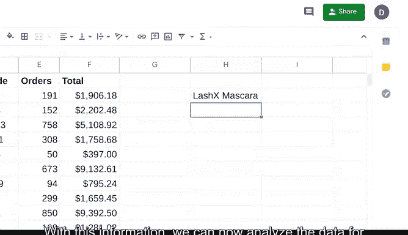

# 017：17_02_07_不同数据视角.zh_en - GPT中英字幕课程资源 - BV19m4y1J7dG

## 📊 课程概述

在本节课中，我们将学习数据分析师如何通过不同的视角和方法来审视数据。改变看待数据的方式，能够帮助我们更高效、更有效地识别和清理数据中的问题。我们将重点介绍排序、筛选、数据透视表、VLOOKUP函数以及数据绘图这几种核心工具。

---

## 🔍 改变视角的重要性

励志演说家韦恩·戴尔曾说：“如果你改变看待事物的方式，你所看到的事物就会改变。” 这句话在数据分析领域尤为贴切。没有任何两个数据分析项目是完全相同的，因此不同的项目需要我们以不同的方式关注不同的信息。

在本视频中，我们将探索数据分析师用来以不同方式查看数据的不同方法，以及这些方法如何带来更高效、更有效的数据清理。

---

## 📈 排序与筛选

上一节我们介绍了改变数据视角的重要性，本节中我们来看看最基础的两个工具：排序和筛选。

正如之前所学，排序和筛选数据有助于数据分析师根据特定项目的需求，自定义和组织信息。但这些工具在数据清理中也同样非常有用。

以下是排序和筛选在数据清理中的具体应用：

*   **排序**：排序涉及将数据排列成有意义的顺序，以便于理解、分析和可视化。在数据清理中，你可以使用排序将数据按字母或数字顺序排列，从而轻松找到特定数据。排序还可以将重复的条目放在一起，以便更快地识别它们。
*   **筛选**：筛选意味着只显示符合特定条件的数据，同时隐藏其余部分。在数据清理时，当你想要查找特定信息时，筛选器非常有用。例如，你可以使用筛选器只查找高于某个数字的值，或者仅查找偶数或奇数值。这有助于你快速找到所需内容，并将所需信息与其他信息分离开来，从而提高数据清理的效率。

---

## 📊 数据透视表

除了排序和筛选，另一种改变数据查看方式的方法是使用数据透视表。

数据透视表是一种用于数据处理的数据汇总工具。它可以对数据库中存储的数据进行排序、重组、分组、计数、求和或求平均值。

在数据清理中，数据透视表用于快速、清晰地查看数据。你可以选择查看数据集中需要的特定部分，并以数据透视表的形式获得可视化结果。

让我们再次使用我们的化妆品制造商电子表格来创建一个数据透视表。

首先，选择我们要使用的数据。这里我们选择整个电子表格。然后选择“数据” -> “数据透视表” -> “新建工作表” -> “创建”。

假设我们正在进行的项目要求我们只查看利润最高的产品，即订单为化妆品制造商带来至少10，000美元利润的产品。

我们将“行”设置为“总利润”，并按降序排序，将利润最高的项目放在顶部，并显示总计。

接下来，我们为“产品”添加另一行，这样我们就知道这些数字对应的是什么产品。

通过数据透视表，我们可以清楚地确定利润最高的产品是产品代码为 `15143 EXFO` 和 `32729 MASC` 的产品。对于这个特定项目，我们可以忽略其余产品，因为它们的订单利润低于10，000美元。

现在，我们或许可以根据上下文线索假设我们正在讨论去角质产品和睫毛膏，但我们不知道具体是哪种，甚至这个假设是否正确。因此，我们需要确认产品代码对应的是什么。这就引出了下一个工具。

---

## 🔎 VLOOKUP函数

VLOOKUP代表垂直查找。它是一个函数，用于在列中搜索某个值以返回相应的信息。

当数据分析师为项目查找信息时，他们需要的所有数据很少会放在同一个地方。通常，你需要在多个工作表甚至不同的数据库中搜索。

VLOOKUP的语法是：`=VLOOKUP(查找值， 查找范围， 返回列索引， [匹配模式])`

具体解释如下：
*   `=VLOOKUP(`：以等号和函数名开始。
*   `查找值`：你想要查找的数据。
*   `，`：逗号分隔参数。
*   `查找范围`：你想要在其中查找数据的区域。在我们的例子中，这将是工作表名称后跟感叹号。感叹号表示我们正在引用当前工作所在工作表之外的另一个工作表中的单元格。这在数据分析中非常常见。
*   `返回列索引`：在查找范围中，包含要返回值的列的索引号（从1开始计数）。
*   `[匹配模式]`：输入 `FALSE` 表示我们寻找精确匹配。最后，用右括号 `)` 结束函数。

简单来说，VLOOKUP在指定位置的最左列中搜索第一个参数中的值。然后，第三个参数的值告诉VLOOKUP从指定列返回同一行的值。`FALSE` 告诉VLOOKUP我们需要精确匹配。

接下来，我们将开始实际操作。我们输入 `=VLOOKUP`，然后添加我们要查找的数据，即产品代码。美元符号 `$` 确保引用的相应部分保持不变或被“锁定”。你可以只锁定列、只锁定行，或者同时锁定两者。

然后，我们告诉它查看工作表2的两列。我们添加了 `2` 来代表第二列。最后一个参数 `FALSE` 表示我们需要精确匹配。

有了这些信息，我们现在可以仅针对利润最高的产品进行数据分析。

---

## 📉 数据绘图

我们将讨论的最后一个工具是数据绘图。当你绘制数据时，你将其放入图表、图形、表格或其他可视化形式中，以帮助你快速了解数据的分布情况。

在尝试识别任何有偏差的数据或异常值时，绘图非常有用。

例如，如果我们想确保每个产品的价格是正确的，我们可以创建一个图表。这将为我们提供一个视觉辅助工具，帮助我们快速判断是否有任何数据看起来像是错误。

让我们选择包含价格的列。然后转到“插入”并选择“图表”。选择柱形图作为类型。

图表中有一个价格看起来极低。如果我们深入研究，会发现这个项目的价格小数点位置错了。它应该是 `$7.30`，而不是 `$0.73`。这会对我们的总利润产生重大影响，因此我们在数据清理过程中发现这个问题是件好事。

---

## 🎯 课程总结

本节课中，我们一起学习了如何通过不同的视角和方法来审视和清理数据。我们介绍了排序和筛选的基础应用，探索了数据透视表如何提供清晰的数据汇总视图，学习了使用VLOOKUP函数跨表查找精确信息，最后通过数据绘图来直观地发现异常值。以新的、创造性的方式查看数据，能帮助数据分析师识别各种类型的“脏数据”。掌握这些工具，将使你的数据清理工作更加高效和准确。