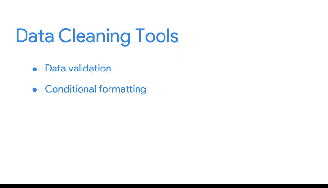

# 018：更多数据清洗技术 🧹

## 概述
在本节课中，我们将学习数据清洗中的一个宏观且至关重要的概念：**数据映射**。我们将了解数据如何在系统间迁移和整合，以及如何通过数据映射确保不同来源的数据能够兼容地协同工作。

---

到目前为止，你已经学习了许多分析师用来清理数据以进行分析的不同工具和函数。

现在，我们将退一步，讨论干净数据的一些宏观层面。

知道如何修复具体问题，无论是使用电子表格工具手动操作还是使用函数，都极具价值。

但同样重要的是，思考你的数据如何在系统间移动，以及它在到达你的数据分析项目之前是如何演变的。

为此，数据分析师会使用一种称为**数据映射**的方法。

**数据映射**是将一个数据库中的字段与另一个数据库中的字段进行匹配的过程。

这对于数据迁移、数据集成以及许多其他数据管理活动的成功至关重要。

正如你之前所学，不同的系统以不同的方式存储数据。

例如，一个电子表格中的“州”字段可能显示为拼写完整的“Maryland”，但另一个电子表格可能将其存储为“MD”。

数据映射帮助我们记录这些差异，以便我们知道当数据被移动和合并时，它们将是兼容的。

快速回顾一下，**兼容性**描述了两个或多个数据集协同工作的能力。

因此，数据映射的第一步是**确定需要移动哪些数据**。

这包括表及其中的字段。

我们还需要**定义数据到达目的地后的期望格式**。

为了理解这是如何运作的，让我们回到两个物流协会合并的例子。

从第一个数据字段开始，我们将确定需要移动两组会员ID。

为了定义期望格式，我们将选择是使用数字（像这个电子表格），还是使用电子邮件地址（像另一个电子表格）。

接下来是**映射数据**。

根据数据源的架构以及主键和外键的数量，数据映射可能很简单，也可能非常复杂。

提醒一下，**架构**是描述事物组织方式的方法。

**主键**引用的是其中每个值都唯一的列。

而**外键**是一个表中的字段，它是另一个表中的主键。

对于更具挑战性的项目，你可以使用各种数据映射软件程序。

这些数据映射工具将逐字段分析如何将数据从一个地方移动到另一个地方。

然后它们会自动清理、匹配、检查和验证数据。

它们还会创建一致的命名约定，确保数据从一个源传输到另一个源时的兼容性。

在选择用于映射数据的软件程序时，你需要确保它支持你正在使用的文件类型，例如 Excel、SQL、Tableau 等。

稍后，你将学习更多关于为特定任务选择正确工具的知识。

现在，让我们练习手动映射数据。

首先，我们需要确定每个部分的内容，以确保数据最终出现在正确的位置。

例如，关于会员资格何时到期的数据，将被合并到一个单独的列中。

此步骤确保每条信息最终都出现在合并数据源中最合适的位置。

现在，你可能还记得两个组织之间的一些数据不一致，例如，一个组织为套房公寓或单元号使用单独的列，但另一个组织没有。

这引出了下一步：**将数据转换为一致的格式**。

这是使用 `CONCATENATE` 函数的好时机。

正如你之前所学，`CONCATENATE` 是一个连接两个或多个文本字符串的函数，这正是我们之前在化妆品公司示例中所做的。

所以，我们将插入一个新列，然后输入 `=CONCATENATE`，接着是我们想要合并的两个文本字符串。

将此公式拖动到整个列，现在我们在新的合并协会会员地址列表中就有了一致性。

好的。既然一切都兼容了，是时候将数据传输到其目的地了。

将数据从一个地方移动到另一个地方有很多不同的方法，包括查询、导入向导，甚至是简单的拖放。

好了，这是我们的合并电子表格。

它看起来不错，但我们仍然想确保所有内容都正确传输了。

因此，我们将进入数据映射的**测试阶段**。

为此，你需要检查一个数据样本，以确认它是干净的且格式正确。

对诸如空值数量等项目进行抽查也是一个明智的做法。

对于测试，你可以使用我们之前讨论过的许多数据清理工具，例如数据验证、条件格式、`COUNTIF`、排序和筛选。

最后，一旦你确定数据是干净且兼容的，你就可以开始将其用于分析了。

数据映射之所以如此重要，是因为在合并数据时，即使是一个错误也可能在整个组织中产生连锁反应，导致相同的错误一次又一次地出现，从而产生糟糕的结果。

另一方面，数据映射可以通过为你提供一个清晰的路线图来确保你的数据安全到达目的地，从而解决问题。

这就是你学习如何操作它的原因。

---

## 总结
本节课中，我们一起学习了**数据映射**的核心概念。我们了解到，数据映射是确保不同来源数据在迁移和整合过程中保持兼容性的关键步骤。通过识别数据、定义格式、手动或自动映射、转换格式、传输数据以及最终测试验证，我们可以构建一个清晰可靠的路线图，将“脏数据”安全地转化为可用于分析的“干净数据”。掌握数据映射，能有效避免因数据合并错误而导致的重复性问题，为后续的数据分析打下坚实基础。