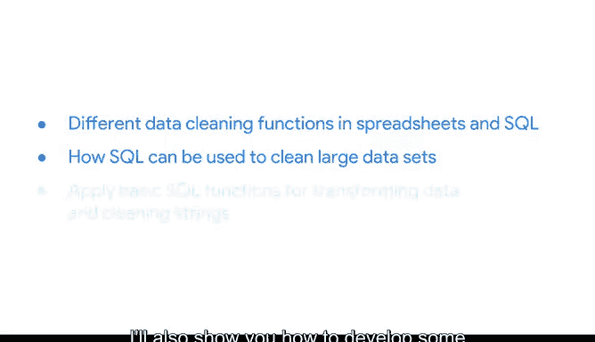

# 019：使用SQL清洗数据 🧹

欢迎回来，你在上周挑战中的表现非常出色。既然我们已经了解了干净数据与脏数据的区别，以及一些通用的数据清洗技术，现在让我们聚焦于使用SQL进行数据清洗。

在本节课中，我们将学习电子表格和SQL中不同的数据清洗函数，以及如何使用SQL来清洗大型数据集。我还会向你展示如何为数据库开发一些基础的搜索查询，以及如何应用基本的SQL函数来转换数据和清洗字符串。数据清洗是数据分析流程中，进入实际分析前的最后一步，而SQL拥有许多出色的工具可以帮助你完成这项工作。

但在我们开始清洗数据库之前，我们将更深入地了解SQL以及何时使用它。

我们稍后见。