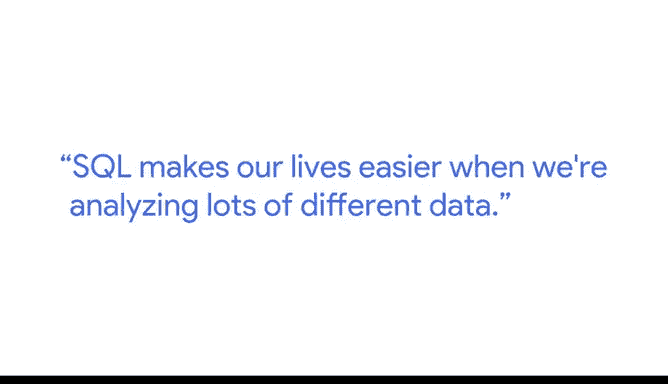
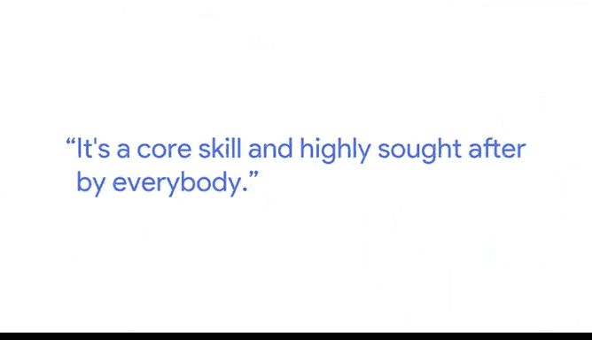

# 020：萨莉谈SQL的重要性 🗃️💡

在本节课中，我们将跟随谷歌的测量与分析负责人萨莉，了解SQL在数据分析师日常工作中的核心作用，以及它如何成为一项高需求的关键技能。

---

广告公司从客户那里获得资金，用于推广客户的品牌。这些公司会使用我们的产品，即某些谷歌广告平台。我的工作是帮助他们如何最有效地使用这些平台，以及他们可以采取哪些策略来成为行业佼佼者。

广告公司的许多员工都需要向客户发送报告。这些报告的创建和可视化需要花费大量时间。因此，我的工作是帮助从业者和分析团队使用一个特定的产品，使他们能够更快、更轻松地创建这些报告。

## SQL：开启数据分析师的大门 🚪

上一节我们了解了数据分析在广告行业的具体应用。本节中，我们来看看SQL技能如何为你的职业生涯铺平道路。

如果你要开始成为一名数据分析师，这项技能会为你打开无数扇门。因为无论哪个行业，每个人都在追踪数据、使用数据、需要数据。从医疗保健到广告，从电子商务到娱乐，所有行业的一切事务都在使用数据。因此，每个人都需要数据分析师。

## SQL如何让分析工作更高效 ⚡

SQL让我们在分析大量不同数据时生活变得更轻松。就在最近，我们使用的SQL程序才能为分析数百万或数十亿数据提供即时结果。

以下是SQL能力演进的关键点：
*   几年前，大约五年前左右，尽管我们仍然可以分析数百万行数据，但查询运行往往需要等待15分钟甚至30分钟。
*   而现在，查询结果是即时返回的。这非常令人兴奋，我们也可以利用这种能力做更多的事情。

## SQL的核心价值与学习心得 💎

因此，SQL对我的职业生涯帮助很大，因为它是数据分析师必须掌握的基础技能之一。在过去，并非每个人都使用SQL。所以，懂SQL绝对是一个竞争优势。如今，我会说越来越多的人，也许是大多数人，都掌握了它。它是一项核心技能，受到所有人的高度追捧。

懂SQL、成为一名数据分析师会让你很受欢迎，在招聘者中相当受欢迎。我认为这很有趣。

我是自学SQL的。所以我对SQL的知识非常珍视，因为它几乎是我为自己创造的技能，我从中获得了巨大的满足感。这就是我如此喜欢SQL的原因。

## 体验SQL的即时魅力 ✨

我喜欢使用SQL的另一个原因是，当你在查询中输入一些内容，然后按下运行键，几乎立刻就能得到结果（取决于你使用的平台）。但令人着迷的是，从概念上思考，计算机根据那一点点命令代码为你完成了多少分析工作。如果你想想幕后发生的事情，它的力量是如此强大。我认为这很有趣。

## 大数据时代的职业前景 📈

我们生活在一个大数据的世界，而且数据量还在不断增长。计算能力也在呈指数级增长。因此，随着我们可以追踪的数据越来越多，我们对数据分析师的需求也越来越大。所以，我们的职业前景基本上是飞速上升的。

我是萨莉，是谷歌的测量与分析负责人。

---

**本节课总结**

本节课中，我们一起学习了SQL在数据分析领域的核心地位。萨莉分享了她作为谷歌测量与分析负责人的经验，阐述了SQL如何从一项竞争优势演变为数据分析师的必备核心技能。我们了解到SQL强大的即时分析能力如何提升工作效率，以及在大数据时代背景下，掌握SQL技能为数据分析师带来的广阔职业前景。