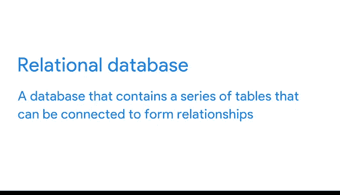

# 021：理解SQL功能 🗄️

在本节课中，我们将要学习SQL（结构化查询语言）的基础知识，了解数据分析师为何以及如何使用SQL来处理大规模数据集，并简要回顾SQL的发展历史。

---

在深入探讨数据分析师使用SQL清理数据的各种方法之前，我们首先需要正式认识一下SQL。我们已经多次提及SQL，也见识过一些数据库和SQL的基本功能，甚至了解了SQL如何用于处理数据。现在，让我们来正式定义SQL。

SQL是结构化查询语言，数据分析师用它来与数据库进行交互。数据分析师通常使用SQL处理大型数据集，因为它能够处理海量数据，甚至可以达到**数万亿行**的规模。

为了让你对这个数据量有更直观的感受，可以想象一个包含全球80亿人姓名的数据集。普通人需要**101年**才能读完这80亿个名字，而SQL可以在**几秒钟内**完成处理。我个人认为这非常酷。

相比之下，电子表格等其他工具处理如此大量的数据可能需要非常长的时间。这正是数据分析师在处理大数据时选择使用SQL的主要原因之一。

---

接下来，让我们简单了解一下SQL的历史。SQL的开发实际上始于20世纪70年代初。1970年，埃德加·F·科德提出了关系型数据库的理论。你可能还记得之前学习过的关系型数据库，它是一种包含一系列可以相互连接以形成关系的表的数据库。

当时，IBM正在使用一个名为System R的关系数据库管理系统。IBM的计算机科学家们试图找到一种方法来操作和检索System R中的数据。他们的第一个查询语言很难使用，因此他们很快转向了下一个版本——SQL。

经过广泛测试，SQL（现在拼写为SQL）于1979年公开发布。到了1986年，SQL已成为关系型数据库通信的标准语言，并且至今仍是如此。这也是数据分析师选择SQL的另一个原因：它是该领域内广为人知的标准。

我第一次使用SQL从真实数据库中提取数据，是在我的第一份数据分析师工作中。在此之前，我没有任何SQL背景知识，只是因为那份工作的要求才了解到它。该职位的招聘人员给了我一周时间来学习，于是我上网研究并最终自学了SQL。作为求职申请流程的一部分，他们甚至给了我一个书面测试，要求我在白板上编写SQL查询和函数。但从那以后，我一直在使用SQL，并且非常喜欢它。

就像我自学SQL一样，我也想提醒你，你也可以自己解决问题。网上有大量优秀的学习资源，所以不要因为某个职位要求而却步，而不先去研究一下。😊

---

既然我们更多地了解了数据分析师在处理大量数据时选择SQL的原因，以及SQL的一些历史，接下来我们将继续学习它的一些实际应用。

在接下来的内容中，我们将回顾一些在电子表格中学到的工具，并看看其中是否有适用于SQL工作的。悄悄告诉你：确实有。😊

---

本节课中我们一起学习了SQL的定义、其处理海量数据的强大能力、选择SQL的主要原因、SQL的简要发展历史，以及自学SQL的可行性。下一节，我们将探索SQL中的具体数据处理工具。