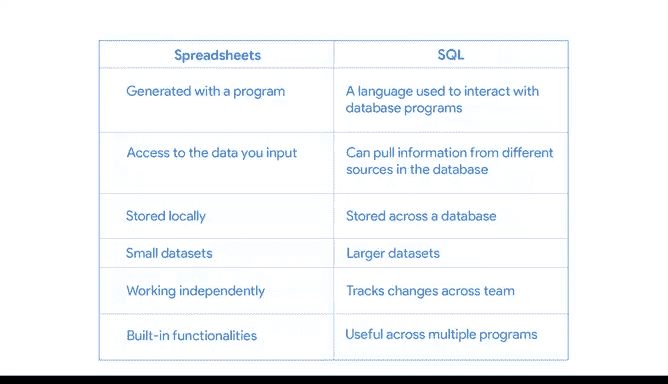

# 022：22_03_05_电子表格与SQL对比.zh_en - GPT中英字幕课程资源 - BV19m4y1J7dG

## 课程概述 📋

在本节课中，我们将要学习电子表格与SQL的异同。我们将探讨这两种工具的共同点、核心差异以及它们各自适用的场景，帮助你理解在数据分析工作中如何选择合适的工具。

---

## 电子表格与SQL的共同点 🤝

上一节我们介绍了电子表格和SQL各自的功能，本节中我们来看看它们之间有哪些相似之处。

电子表格和SQL实际上有很多共同点。具体来说，你可以在这两种工具中使用相似的工具来达成类似的结果。

我们已经学习过一些在电子表格中清洗数据的工具，这意味着你已经掌握了一些可以在SQL中使用的工具。

以下是它们共有的核心功能：

*   **算术运算**：你可以在SQL中执行计算。
*   **使用公式**：SQL中也有类似公式的查询语句。
*   **连接数据**：你可以在SQL中进行数据表的连接操作。

因此，我们可以将在电子表格中学到的技能应用到SQL中，并用它们来完成更复杂的工作。

---

## 复杂工作的示例：医院数据分析 🏥

为了说明什么是“更复杂的工作”，让我们来看一个例子。

如果我们正在处理一家医院的健康数据，我们需要能够访问和处理大量数据。

我们可能需要患者姓名、生日和地址等人口统计数据，他们的保险信息或过往就诊记录，公共卫生数据，甚至需要添加到他们病历中的用户生成数据。

所有这些数据都存储在不同的地方，甚至可能以不同的格式存储，每个位置可能有数百万行数据和数百个相关的数据表。这些数据量太大，无法手动输入，即使只针对一家医院也是如此。

这时SQL就派上用场了。我们无需查看每个单独的数据源并将其记录到电子表格中，而是可以使用SQL从数据库的不同位置提取所有这些信息。

现在，假设我们想在这海量数据中找到特定的信息，比如今天有多少患有某种诊断的病人前来就诊。

在电子表格中，我们可以使用 `COUNTIF` 函数来找出答案。

或者，我们可以在SQL中结合 `COUNT` 和 `WHERE` 查询来找出有多少行数据符合我们的搜索条件。

这两种方法会给出相似的结果，但SQL能够处理更庞大、更复杂的数据集。

---

## 电子表格与SQL的差异 🔄

接下来，我们来谈谈电子表格和SQL的不同之处。

首先，理解电子表格和SQL是两种不同的事物很重要。

电子表格是由像Excel或Google Sheets这样的程序生成的。这些程序旨在执行某些内置功能。

另一方面，SQL是一种语言，可用于与数据库程序（如Oracle、MySQL或Microsoft SQL Server）进行交互。

两者之间的差异主要在于它们的使用方式。

如果数据分析师获得的数据是电子表格形式，他们很可能会在该电子表格内进行数据清洗和分析。

但如果他们处理的是大型数据，例如超过一百万行或数据库中的多个文件，使用SQL会更简单、更快速且更具可重复性。

SQL可以访问和使用更多的数据，因为它可以自动从数据库的不同来源提取信息，这与电子表格不同，电子表格只能访问你输入的数据。

这也意味着数据存储在多个地方。数据分析师在独立工作时，可能会使用存储在本地硬盘或个人云端的电子表格。

但如果他们在一个更大的团队中，有多个分析师需要访问和使用数据库中的数据，SQL可能是一个更有用的工具。

---

## 适用场景总结 📊

由于这些差异，电子表格和SQL用于不同的事情。

正如你已经知道的，电子表格适用于较小的数据集，并且当你独立工作时非常方便。此外，电子表格具有内置功能，如拼写检查，这些功能非常实用。

SQL则非常适合处理大型数据集，即使是数万亿行的数据。

并且，由于SQL长期以来一直是与数据库通信的标准语言，它可以被调整并用于多种数据库程序。SQL还会记录查询的更改，这使得在团队协作时，可以轻松跟踪团队中的变更。

---

## 下节预告 🚀

接下来，我们将学习SQL中更多的查询和函数，这些将为你提供一些新的工具。你甚至可能会学到如何以全新的方式使用电子表格工具。下次见。

---

## 课程总结 ✨

本节课中我们一起学习了电子表格与SQL的对比。我们了解到，尽管两者在算术运算、公式使用和数据连接方面有共同之处，但它们在本质、数据容量、协作方式和适用场景上存在显著差异。电子表格适合处理小型数据和独立工作，而SQL则是处理大型、复杂数据集和团队协作的强大工具。理解这些差异将帮助你在实际工作中做出更明智的工具选择。